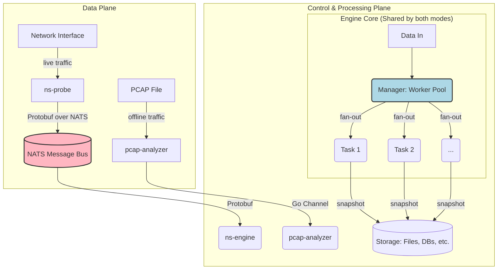

# Go2NetSpectra Project Context

## 1. Project Overview & Vision

Go2NetSpectra is a **distributed, high-performance network traffic monitoring and analysis framework** written in Go. Its ultimate goal is to provide a scalable, end-to-end platform for deep, real-time, and offline analysis of network traffic, suitable for network performance monitoring, security analysis, and operational observability.

The project is designed with a **dual-mode architecture**:

1.  **Offline Analysis**: A `pcap-analyzer` tool for deep, batch processing of `.pcap` files.
2.  **Real-time Monitoring**: A decoupled, real-time pipeline where lightweight `ns-probe` agents capture live traffic, publish it to a central message bus (NATS), allowing one or more `ns-engine` instances to consume, process, and store the data in real-time.

This `GEMINI.md` file outlines both the **current state** and the **future development roadmap** based on the project's requirements documentation.

---

## 2. Architecture Blueprint

The project is centered around a highly flexible, three-tier engine architecture (`StreamAggregator` -> `Manager` -> `Task`) that is shared by both offline and real-time modes.



### Component Responsibilities:

- **`ns-probe`**: Captures packets, performs initial parsing, and publishes them to NATS using Protobuf.
- **`pcap-analyzer`**: Reads packets from a `.pcap` file and feeds them into the Engine Core for offline analysis.
- **`ns-engine`**: The real-time processing unit. Subscribes to NATS and feeds the data into the Engine Core for real-time aggregation.
- **Engine Core (`Manager` + `Task`)**: The heart of the system. The `Manager` provides a concurrent worker pool to dispatch packets to one or more `Task` modules. Each `Task` is a self-contained, pluggable unit that performs a specific aggregation logic, driven by configuration.

---

## 3. Development Roadmap & Current Status

This roadmap is based on `doc/re.md`.

### Milestone 1: Core Engine & Offline Analysis
- **Status**: ✅ **Completed**
- **Key Deliverables**: A flexible, pluggable, and high-performance aggregation engine featuring a `Manager` (concurrent dispatcher) and `Task` (pluggable logic) architecture. The `pcap-analyzer` CLI uses this engine to process `.pcap` files.

### Milestone 2: Real-time Data Pipeline (Alpha)
- **Status**: ✅ **Partially Completed**
- **Completed Work**:
    - `ns-probe` CLI for capturing live traffic and publishing it to NATS via Protobuf.
    - `ns-engine` service that subscribes to NATS and feeds the data into the core engine.
    - The entire real-time data flow (`probe` -> `NATS` -> `engine`) is operational.
- **Next Steps (Immediate Priority)**:
    1.  Implement the `Writer` logic within `ns-engine` to periodically save the aggregated results from the `Task` snapshots to persistent storage (e.g., local files).
    2.  Begin integration with time-series databases like ClickHouse or VictoriaMetrics.

### Milestone 3: API & Productization (Beta)
- **Status**: ⬜ **Not Started**
- **Key Deliverables**: `ns-api` service for data queries, containerization (Docker/Kubernetes), deployment guides.

---

## 4. Building and Running (Current State)

This section covers how to run the **currently implemented** features. For a more detailed guide, see `doc/build.md`.

### Prerequisites

- Go (1.21+), `protoc`, Docker.

### First-Time Setup (Protobuf Generation)

```sh
go install google.golang.org/protobuf/cmd/protoc-gen-go@v1.28
protoc --proto_path=api/proto --go_out=. api/proto/v1/traffic.proto
```

### Running the Real-time Pipeline

1.  **Terminal 1 (NATS)**: `docker run --rm -p 4222:4222 -ti nats:latest`
2.  **Terminal 2 (Engine)**: `go run ./cmd/ns-engine/main.go`
3.  **Terminal 3 (Probe)**: `sudo go run ./cmd/ns-probe/main.go --mode=probe --iface=<interface_name>`

### Running Offline Analysis

```sh
go run ./cmd/pcap-analyzer/main.go <path_to_pcap_file>
```