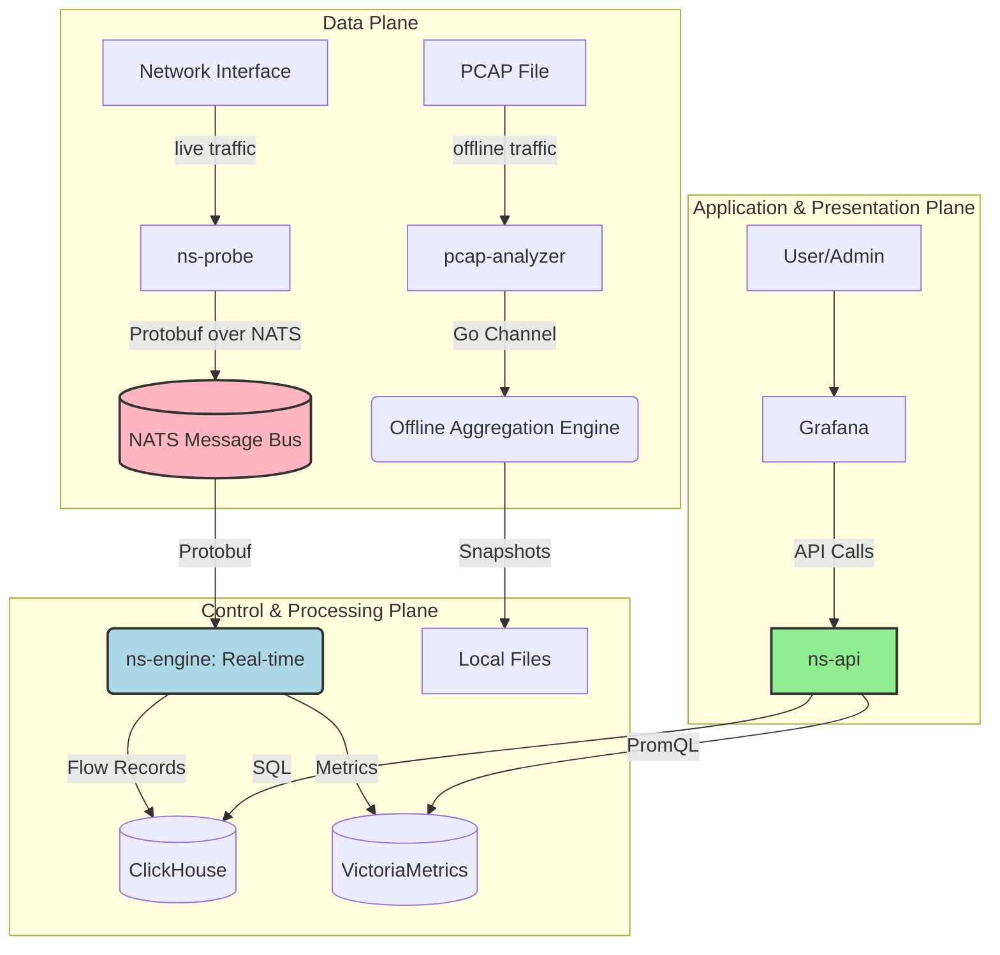

# Go2NetSpectra Project Context

## 1. Project Overview & Vision

Go2NetSpectra is a **distributed, high-performance network traffic monitoring and analysis framework** written in Go. Its ultimate goal is to provide a scalable, end-to-end platform for deep, real-time, and offline analysis of network traffic, suitable for network performance monitoring, security analysis, and operational observability.

The project is designed with a **dual-mode architecture**:

1.  **Offline Analysis**: A `pcap-analyzer` tool for deep, batch processing of `.pcap` files using a high-concurrency aggregation engine.
2.  **Real-time Monitoring**: A decoupled, real-time pipeline where lightweight `ns-probe` agents capture live traffic, publish it to a central message bus (NATS), allowing one or more `ns-engine` instances to consume, process, and store the data in real-time.

This `GEMINI.md` file outlines both the **current state** and the **future development roadmap** based on the project's requirements documentation.

---

## 2. Architecture Blueprint (Target State)

The following diagram illustrates the target architecture of the fully realized Go2NetSpectra platform.



### Component Responsibilities:

- **`ns-probe`**: Captures packets, performs initial parsing, and publishes them to NATS using Protobuf. Designed to be lightweight.
- **`ns-engine`**: The core processing unit. Subscribes to NATS, performs stateful stream aggregation (managing flow lifecycle), calculates advanced metrics (e.g., using HyperLogLog, Count-Min Sketch), and writes results to storage.
- **`ns-api`**: The central data query endpoint. Provides a RESTful/GraphQL API for querying aggregated data from the storage layer.
- **NATS**: The data bus, decoupling producers (`ns-probe`) from consumers (`ns-engine`).
- **ClickHouse / VictoriaMetrics**: The storage layer for long-term retention of flow records and time-series metrics, respectively.

---

## 3. Development Roadmap & Current Status

This roadmap is based on `doc/re.md`.

### Milestone 1: Core Engine & Offline Analysis
- **Status**: ✅ **Completed**
- **Key Deliverables**: `pcap-analyzer` CLI, high-performance `ExactAggregator` with sharding and graceful shutdown.

### Milestone 2: Real-time Data Pipeline (Alpha)
- **Status**: ✅ **Partially Completed**
- **Completed Work**:
    - `ns-probe` CLI with dual `probe` and `sub` modes.
    - Real-time capture using `gopacket`.
    - NATS integration with Protobuf serialization.
- **Next Steps (Immediate Priority)**:
    1.  Implement the `ns-engine` service to consume data from NATS.
    2.  Develop a `StreamAggregator` within the engine that manages flow lifecycle (active/timeout).
    3.  Create a basic `ConsoleWriter` or `ClickHouseWriter` to persist the aggregated results from the real-time engine.

### Milestone 3: API & Productization (Beta)
- **Status**: ⬜ **Not Started**
- **Key Deliverables**: `ns-api` service for data queries, containerization (Docker/Kubernetes), deployment guides.

### Milestone 4: Distributed & High-Availability (Release)
- **Status**: ⬜ **Not Started**
- **Key Deliverables**: Horizontal scaling for `ns-engine`/`ns-api`, Helm charts, stress testing.

---

## 4. Building and Running (Current State)

This section covers how to run the **currently implemented** features.

### Prerequisites

- Go (1.21+), `protoc`, Docker.

### First-Time Setup (Protobuf Generation)

```sh
go install google.golang.org/protobuf/cmd/protoc-gen-go@v1.28
protoc --proto_path=api/proto --go_out=. api/proto/v1/traffic.proto
```

### Running the Real-time Pipeline (for Milestone 2 validation)

1.  **Terminal 1 (NATS)**: `docker run --rm -p 4222:4222 -ti nats:latest`
2.  **Terminal 2 (Subscriber)**: `go run ./cmd/ns-probe/main.go --mode=sub`
3.  **Terminal 3 (Probe)**: `sudo go run ./cmd/ns-probe/main.go --mode=probe --iface=<interface_name>`

### Running Offline Analysis (Milestone 1)

```sh
go run ./cmd/pcap-analyzer/main.go <path_to_pcap_file>
```