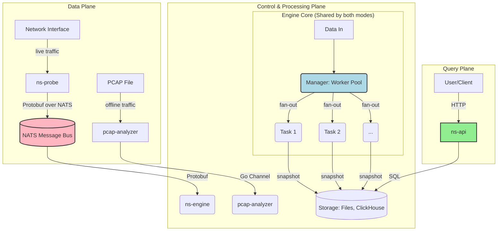

# Go2NetSpectra

[](https://go.dev/) [](https://github.com/google/gopacket) [](https://nats.io/) [](https://protobuf.dev/) [](https://www.docker.com/)

**Go2NetSpectra** is a high-performance, distributed network traffic monitoring and analysis framework written in Go. It features a decoupled, dual-mode architecture supporting both real-time monitoring via NATS and offline analysis of `.pcap` files. The core engine is designed to be highly extensible and pluggable, allowing developers to easily add new aggregation and analysis tasks.

---

## Architecture Overview

The project is centered around a highly flexible, three-tier engine architecture (`StreamAggregator` -> `Manager` -> `Task`) that is shared by both offline and real-time modes.


- **`ns-probe`**: Captures live traffic and publishes it to NATS. Can also persist raw packets to local files (`.pcap`, `.log`, `.gob`). Can also persist raw packets to local files (`.pcap`, `.log`, `.gob`).
- **`pcap-analyzer`**: Reads packets from `.pcap` files for offline analysis.
- **`ns-engine`**: Subscribes to NATS and feeds real-time data into the core engine for aggregation.
- **`ns-api`**: Provides a RESTful API to query aggregated data from ClickHouse.
- **Engine Core**: A concurrent, pluggable engine (`Manager` + `Task` model) that performs the actual aggregation, shared by both real-time and offline modes.

For a more detailed explanation of the architecture, see [`doc/technology.md`](doc/technology.md).

---

## Getting Started

This guide covers the basic steps to get the project running. For more details, please refer to [`doc/build.md`](doc/build.md).

### 1. Prerequisites

- Go 1.21+
- `protoc` Compiler
- Docker

### 2. First-Time Setup (Protobuf Generation)

Install the Go plugin and generate the code:
```sh
go install google.golang.org/protobuf/cmd/protoc-gen-go@v1.28
protoc --proto_path=api/proto --go_out=. api/proto/v1/*.proto
```

### 3. Running the Full Pipeline (Probe, Engine, API)

You will need multiple separate terminals.

**Terminal 1: Start Dependencies (NATS & ClickHouse)**
```sh
# Start NATS
docker run --rm -p 4222:4222 nats:latest

# In another terminal, start ClickHouse (use a password)
docker run -d -p 18123:8123 -p 19000:9000 -e CLICKHOUSE_PASSWORD=123 --name some-clickhouse-server --ulimit nofile=262144:262144 clickhouse/clickhouse-server
```

**Terminal 2: Start the Engine**

Ensure your `configs/config.yaml` has the `clickhouse` writer enabled with the correct port (`19000`) and password (`123`).
```sh
go run ./cmd/ns-engine/main.go
```

**Terminal 3: Start the API Server**
```sh
go run ./cmd/ns-api/main.go
```

**Terminal 4: Start the Probe**

(Replace `<interface_name>` with your network interface, e.g., `en0` or `eth0`)
```sh
sudo go run ./cmd/ns-probe/main.go --mode=probe --iface=<interface_name>
```

### 4. Querying the API

After letting the probe run for a minute, use the provided query script in `scripts/query/`.

*   **Get aggregated totals for a task**:
    ```sh
    go run ./scripts/query/main.go -mode=aggregate -task=per_src_ip
    ```

*   **Trace a specific flow's lifecycle**:
    
    ```sh
    go run ./scripts/query/main.go -mode=trace -task=per_five_tuple -key="SrcIP=1.2.3.4,DstPort=443"
    ```
