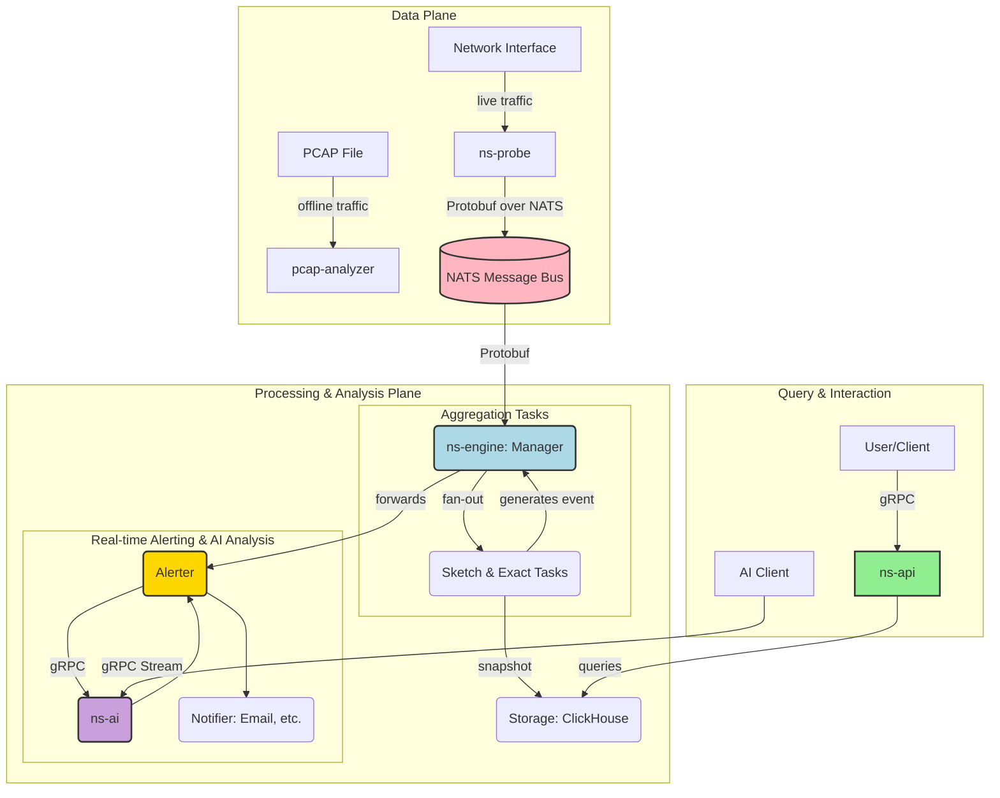

# Go2NetSpectra

[](https://go.dev/) [](https://github.com/google/gopacket) [](https://nats.io/) [](https://protobuf.dev/) [](https://www.docker.com/)

**Go2NetSpectra** is a high-performance, distributed network traffic monitoring and analysis framework written in Go. It provides a powerful platform for network engineers, security analysts, and SREs to gain deep, multi-dimensional insights into network traffic in real-time. By leveraging a high-speed data pipeline and a flexible, pluggable aggregation engine, Go2NetSpectra is built to scale from simple network monitoring to complex security threat detection.

### Core Features

- **Hybrid Analysis Engine**: Simultaneously runs multiple aggregator types. This allows the system to perform **100% accurate accounting** (`exact` mode) and **high-performance probabilistic analysis** (`sketch` mode) *at the same time*, enabling powerful, data-driven workflows (e.g., use `sketch` to find anomalies, then use `exact` to get precise details).
- **AI-Powered Alert Analysis**: A new `ns-ai` microservice provides intelligent analysis for triggered alerts. It enriches notifications with root cause analysis, threat assessment, and mitigation suggestions, turning raw alerts into actionable insights.
- **Real-time Alerting**: A built-in alerting pipeline allows tasks to generate event messages (e.g., heavy hitter detected). These are processed by a central `Alerter` which can trigger notifications via webhooks, providing immediate insights into network events.
- **Pluggable Aggregation Algorithms**: The `sketch` aggregator is a micro-framework that dynamically loads different estimation algorithms based on configuration. Currently supports **Count-Min Sketch** (for heavy hitters) and **SuperSpread** (for cardinality/super-spreaders).
- **High-Performance by Design**: Built from the ground up for performance, utilizing Go's concurrency model (worker pools), lock-free optimizations (atomic operations in sketches), and efficient data serialization (Protobuf).
- **Decoupled & Scalable**: All major components (`probe`, `engine`, `api`, `ai`) are decoupled via a message bus or gRPC and are designed to be horizontally scalable, making the system suitable for high-volume, distributed environments.

---

## Architecture Overview

Go2NetSpectra operates as a multi-stage, distributed pipeline designed for performance, scalability, and real-time analysis.



- **Data Sources**: The system processes both live traffic via `ns-probe` and offline `pcap` files using `pcap-analyzer`.
- **Pipeline**: Live data is serialized with Protobuf and streamed through NATS, decoupling the probe from the processing engine.
- **Engine Core**: The heart of the system, where the `Manager` orchestrates a worker pool. It fans out incoming data to various pluggable `Task` aggregators (like `Exact` and `Sketch`) for parallel processing.
- **Persistence & Alerting**: Aggregated data is periodically snapshotted to a ClickHouse database. Simultaneously, tasks can generate real-time events, which are routed through the `Alerter`. The `Alerter` can then call the `ns-ai` service for intelligent analysis before sending a rich notification.
- **Query & Visualization**: The `ns-api` server provides a gRPC endpoint for programmatic queries and an HTTP/JSON endpoint for visualization tools like Grafana. A separate `ns-ai` service provides gRPC endpoints for both simple and streaming AI interactions.

For a more detailed explanation of the architecture, configuration files (`config.yaml` vs `config.docker.yaml`), and how to run validation tests, see [`doc/technology.md`](doc/technology.md) and [`doc/build.md`](doc/build.md).

---

## Getting Started

This guide provides two primary ways to run the project. Choose the one that best fits your needs.

### Prerequisites

- Go 1.25+
- `protoc` Compiler
- Docker and Docker Compose
- `godotenv` (for local development, automatically handled by `go mod`)

### First-Time Setup (Protobuf Generation)

This step is only required once, or whenever you modify a `.proto` file in the `api/proto/v1/` directory.
```sh
# Install Go plugins for protoc
go install google.golang.org/protobuf/cmd/protoc-gen-go@v1.28
go install google.golang.org/grpc/cmd/protoc-gen-go-grpc@v1.2

# Generate Go code
protoc --proto_path=api/proto \
       --go_out=. --go-grpc_out=. \
       api/proto/v1/*.proto
```

---

### Configuration Management with Environment Variables

Go2NetSpectra uses a single `configs/config.yaml` file for all configurations. Sensitive data and environment-specific settings (like service addresses) are managed via **environment variables** using `${VAR_NAME}` placeholders in `config.yaml`.

- **Local Development**: Create a `.env` file in the project root (copy from `.env.example`) and fill in your local settings. The Go applications will automatically load these variables.
- **Docker Compose**: Create a `.docker.env` file in the `deployments/docker-compose/` directory (copy from `.env.example`) and fill in your Docker-specific settings. `docker-compose` will automatically load these variables for the services.

---

### Option 1: Run with Docker Compose (Recommended)

This is the easiest way to run the entire backend system. You will run all backend services (`nats`, `clickhouse`, `ns-engine`, `ns-api`, `ns-ai`, `grafana`) in Docker, and then run `ns-probe` on your local machine to capture and send traffic.

**Step 1: Prepare `.docker.env`**

Copy `configs/.env.example` to `deployments/docker-compose/.docker.env` and fill in the appropriate values for your Docker environment (e.g., `CLICKHOUSE_HOST=clickhouse`, `NATS_URL=nats://nats:4222`).

**Step 2: Start Backend Services**

Navigate to the Docker Compose directory and start all services.

```sh
cd deployments/docker-compose/
docker compose up --build
```
Leave this terminal running.

**Step 3: Capture Traffic on Host**

Open a **new terminal**. Run `ns-probe` locally to capture traffic and send it to the NATS container. Ensure your local `.env` (or environment variables) has `NATS_URL=nats://localhost:4222`.

```sh
# Replace <interface_name> with your network interface (e.g., en0, eth0)
sudo go run ./cmd/ns-probe/main.go --mode=probe --iface=<interface_name>
```

**Step 4: Query the API & Interact with AI**

Open a **third terminal** and use the scripts to interact with the services.

```sh
# Example: Query for aggregated flows
go run ./scripts/query/v2/main.go --mode=aggregate --task=per_src_ip

# Example: Query for heavy hitters detected by a sketch task
go run ./scripts/query/v2/main.go --mode=heavyhitters --task=per_src_ip --type=0 --limit=10

# Example: Interact with the AI service (ensure AI_GRPC_LISTEN_ADDR is set in your local .env)
go run ./scripts/ask-ai/main.go "Summarize the network traffic anomalies."
```

---

### Option 2: Run Locally for Development

This mode is useful for debugging individual components (`ns-probe`, `ns-engine`, `ns-api`, `ns-ai`) directly on your machine, while still using Docker for external dependencies.

**Step 1: Prepare `.env`**

Copy `configs/.env.example` to the project root (`.env`) and fill in the appropriate values for your local development environment (e.g., `CLICKHOUSE_HOST=localhost`, `NATS_URL=nats://localhost:4222`).

**Step 2: Start Dependencies in Docker**

```sh
# Terminal 1: Start NATS
docker run --rm -p 4222:4222 nats:latest

# Terminal 2: Start ClickHouse (note the port mapping 19000:9000)
docker run -d -p 18123:8123 -p 19000:9000 -e CLICKHOUSE_PASSWORD=${CLICKHOUSE_PASSWORD} --name some-clickhouse-server --ulimit nofile=262144:262144 clickhouse/clickhouse-server
```

**Step 3: Run Go Applications Locally**

Open a separate terminal for each command. The applications will automatically pick up settings from your `.env` file.

```sh
# Terminal 3: Start the Engine
go run ./cmd/ns-engine/main.go

# Terminal 4: Start the API Server (v2)
go run ./cmd/ns-api/v2/main.go

# Terminal 5: Start the AI Service
go run ./cmd/ns-ai/main.go

# Terminal 6: Start the Probe
sudo go run ./cmd/ns-probe/main.go --mode=probe --iface=<interface_name>
```