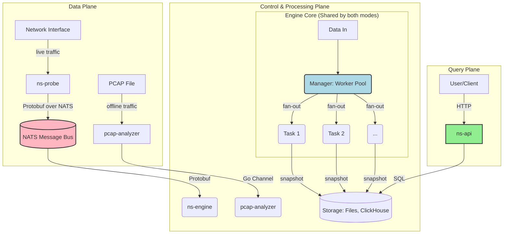

# Go2NetSpectra

[](https://go.dev/) [](https://github.com/google/gopacket) [](https://nats.io/) [](https://protobuf.dev/) [](https://www.docker.com/)

**Go2NetSpectra** is a high-performance, distributed network traffic monitoring and analysis framework written in Go. It provides a powerful platform for network engineers, security analysts, and SREs to gain deep, multi-dimensional insights into network traffic in real-time. By leveraging a high-speed data pipeline and a flexible, pluggable aggregation engine, Go2NetSpectra is built to scale from simple network monitoring to complex security threat detection.

### Core Features

- **Dual-Mode Architecture**: Supports both **real-time** traffic monitoring from live interfaces and **offline** analysis of `.pcap` files with a unified core engine.
- **Pluggable Aggregation Engine**: The engine core uses a factory pattern to dynamically load aggregation tasks. This allows you to easily add new analysis algorithms (e.g., exact counting, HyperLogLog, etc.) without modifying the core code.
- **High-Performance Design**: Built from the ground up for performance, utilizing Go's concurrency model (worker pools, channels), lock-free optimizations (sharding, atomic snapshots), and efficient data serialization (Protobuf).
- **Decoupled & Scalable**: All major components (`probe`, `engine`, `api`) are decoupled and designed to be horizontally scalable, making the system suitable for high-volume, distributed environments.

---

## Architecture Overview

The project is centered around a highly flexible, three-tier engine architecture that is shared by both offline and real-time modes.


- **`ns-probe`**: A lightweight, high-performance probe that captures live traffic from a network interface. It parses packet metadata and publishes it to NATS. It can also be configured to persist raw packets locally for backup or replay.
- **`pcap-analyzer`**: A command-line tool for offline analysis. It reads packets from `.pcap` files and feeds them directly into the core engine, bypassing the NATS pipeline.
- **`ns-engine`**: The heart of the system. It subscribes to the data stream from NATS and orchestrates a pool of concurrent workers to process and aggregate the traffic data in real-time using either exact counting or sketch algorithms (like Count-Min Sketch).
- **`ns-api`**: A RESTful API server that provides query capabilities over the aggregated data stored in ClickHouse, offering endpoints for both high-level summaries and detailed flow tracing.
- **Engine Core**: The shared brain of the system, featuring a `Manager` that schedules and a set of `Task` plugins that execute the actual aggregation logic.

For a more detailed explanation of the architecture, configuration files (`config.yaml` vs `config.docker.yaml`), and how to run validation tests, see [`doc/technology.md`](doc/technology.md) and [`doc/build.md`](doc/build.md).

---

## Getting Started

(The rest of the README remains the same)

This guide provides two primary ways to run the project. Choose the one that best fits your needs.

### Prerequisites

- Go 1.22+
- `protoc` Compiler
- Docker and Docker Compose

### First-Time Setup (Protobuf Generation)

This step is only required once, or whenever you modify a `.proto` file in the `api/proto/v1/` directory.
```sh
go install google.golang.org/protobuf/cmd/protoc-gen-go@v1.28
protoc --proto_path=api/proto --go_out=. api/proto/v1/*.proto
```

---

### Option 1: Run with Docker Compose (Recommended)

This is the easiest way to run the entire backend system. You will run all backend services (`nats`, `clickhouse`, `ns-engine`, `ns-api`) in Docker, and then run `ns-probe` on your local machine to capture and send traffic.

**Step 1: Configure for Local Probe**

Ensure your **`configs/config.yaml`** is configured for your local `ns-probe` to connect to the Dockerized NATS service. The `probe` section should point to `localhost`.

```yaml
# configs/config.yaml
probe:
  nats_url: "nats://localhost:4222"
  # ...
```

**Step 2: Start Backend Services**

Navigate to the Docker Compose directory and start all services. This uses `configs/config.docker.yaml` internally for container-to-container communication.

```sh
cd deployments/docker-compose/
docker compose up --build
```
Leave this terminal running.

**Step 3: Capture Traffic on Host**

Open a **new terminal**. Run `ns-probe` locally to capture traffic and send it to the NATS container.

```sh
# Replace <interface_name> with your network interface (e.g., en0, eth0)
sudo go run ./cmd/ns-probe/main.go --mode=probe --iface=<interface_name>
```

**Step 4: Query the API**

Open a **third terminal** and use the query script to interact with the `ns-api` container.

```sh
go run ./scripts/query/main.go -mode=aggregate -task=per_src_ip
```

---

### Option 2: Run Locally for Development

This mode is useful for debugging individual components (`ns-probe`, `ns-engine`, `ns-api`) directly on your machine, while still using Docker for external dependencies.

**Step 1: Start Dependencies in Docker**

```sh
# Terminal 1: Start NATS
docker run --rm -p 4222:4222 nats:latest

# Terminal 2: Start ClickHouse (note the port mapping 19000:9000)
docker run -d -p 18123:8123 -p 19000:9000 -e CLICKHOUSE_PASSWORD=123 --name some-clickhouse-server --ulimit nofile=262144:262144 clickhouse/clickhouse-server
```

**Step 2: Configure for Localhost**

Ensure your **`configs/config.yaml`** is configured for all services to connect to `localhost`.

```yaml
# configs/config.yaml
probe:
  nats_url: "nats://localhost:4222"
  # ...

aggregator:
  exact:
    writers:
      - type: "clickhouse"
        clickhouse:
          host: "localhost"
          port: 19000
          password: "123"
          # ...

api:
  listen_addr: ":8080"
```

**Step 3: Run Go Applications Locally**

Open a separate terminal for each command.

```sh
# Terminal 3: Start the Engine
go run ./cmd/ns-engine/main.go

# Terminal 4: Start the API Server
go run ./cmd/ns-api/main.go

# Terminal 5: Start the Probe
sudo go run ./cmd/ns-probe/main.go --mode=probe --iface=<interface_name>
```