# Go2NetSpectra

[](https://go.dev/) [](https://github.com/google/gopacket) [](https://nats.io/) [](https://protobuf.dev/) [](https://clickhouse.com/) [](https://grafana.com/) [](https://www.docker.com/) [](https://kubernetes.io/) [](LICENSE)

## 📖 Overview

**Go2NetSpectra** is a high-performance, distributed network traffic monitoring and analysis framework written in Go. It provides a powerful platform for network engineers, security analysts, and SREs to gain deep, multi-dimensional insights into network traffic in real-time.

By leveraging a high-speed data pipeline, a flexible pluggable aggregation engine, and AI-powered threat analysis, Go2NetSpectra enables everything from basic network performance monitoring to sophisticated security threat detection, all at scale.

### ✨ Key Features

- **🔀 Hybrid Analysis Engine**: Simultaneously run multiple aggregator types (Exact + Sketch) for **100% accurate accounting** and **high-performance probabilistic analysis** at the same time. Use Sketch to find anomalies, then use Exact to get precise details.

- **🤖 AI-Powered Alert Analysis**: The new `ns-ai` microservice provides intelligent analysis for triggered alerts. It enriches notifications with root cause analysis, threat assessment, and mitigation suggestions, turning raw alerts into actionable insights.

- **⚡ Real-Time Alerting**: A built-in alerting pipeline allows tasks to generate event messages. These are processed by a central `Alerter` which can trigger notifications via webhooks, providing immediate insights into network events.

- **🧩 Pluggable Aggregation Algorithms**: The `sketch` aggregator is a micro-framework supporting multiple estimation algorithms via configuration:
  - **Count-Min Sketch**: Heavy hitter detection with configurable accuracy
  - **SuperSpread**: Cardinality estimation and super-spreader detection

- **⚙️ High-Performance by Design**: Built from the ground up for performance:
  - Lock-free atomic operations in sketches
  - Worker pool concurrency with optimal goroutine scheduling
  - Efficient Protobuf serialization
  - Zero-copy data handling where possible

- **📊 Full-Stack Observability**: Built-in support for:
  - Real-time Grafana dashboards
  - Structured alerting with webhooks
  - Multiple data backends (ClickHouse, File-based storage)
  - Comprehensive query APIs (gRPC + HTTP/JSON)

- **🚀 Scalable & Distributed**: All components are decoupled and horizontally scalable:
  - NATS for message bus decoupling
  - Stateless microservices (Engine, API, AI)
  - Kubernetes-ready with Helm charts
  - Automatic leader election and failover

- **🔍 Intelligent Search**: Support for both exact and approximate queries:
  - Precise flow accounting with 100% accuracy
  - Fast probabilistic heavy hitter detection
  - Flexible multi-dimensional aggregations

---

## 🏗️ System Architecture

Go2NetSpectra operates as a multi-stage, distributed pipeline designed for performance, scalability, and real-time analysis.

```mermaid
graph TD
    subgraph DataPlane["📊 Data Collection Plane"]
        direction LR
        Iface["🖧 Network Interface"]
        Pcap["📁 PCAP Files"]
        Probe["🔍 ns-probe<br/>Live Capture"]
        Analyzer["🔬 pcap-analyzer<br/>Offline Analysis"]
        
        Iface -->|live traffic| Probe
        Pcap -->|offline traffic| Analyzer
        
        style Iface fill:#FF6B6B,stroke:#C92A2A,stroke-width:2px,color:#fff
        style Pcap fill:#FF6B6B,stroke:#C92A2A,stroke-width:2px,color:#fff
        style Probe fill:#FF8787,stroke:#C92A2A,stroke-width:2px,color:#fff
        style Analyzer fill:#FF8787,stroke:#C92A2A,stroke-width:2px,color:#fff
    end

    subgraph MessageBus["🚌 Message Bus"]
        direction TB
        NATS["📬 NATS<br/>Message Broker"]
        
        style NATS fill:#FFA94D,stroke:#E67700,stroke-width:3px,color:#333
    end

    subgraph ProcessingPlane["⚙️ Processing & Analysis Plane"]
        direction TB
        
        subgraph Engine["🧠 ns-engine: Core Processing"]
            Manager["📋 Manager<br/>Worker Pool Orchestrator"]
            
            style Manager fill:#4ECDC4,stroke:#099268,stroke-width:2px,color:#fff
        end
        
        subgraph Aggregators["📈 Aggregation Tasks"]
            ExactTask["✓ Exact Task<br/>100% Accurate"]
            SketchTask["⚡ Sketch Task<br/>Probabilistic<br/>Count-Min/SuperSpread"]
            
            style ExactTask fill:#45B7D1,stroke:#0A6B8C,stroke-width:2px,color:#fff
            style SketchTask fill:#5DADE2,stroke:#1B4965,stroke-width:2px,color:#fff
        end
        
        subgraph Alerting["🚨 Real-time Alerting & AI"]
            Alerter["⚠️ Alerter<br/>Rule Evaluation"]
            AI_Service["🤖 ns-ai<br/>AI Analysis Gateway"]
            Notifier["📧 Notifier<br/>Email/Webhook"]
            
            style Alerter fill:#FFD700,stroke:#CC9900,stroke-width:2px,color:#333
            style AI_Service fill:#C9A0DC,stroke:#6B4BA1,stroke-width:2px,color:#fff
            style Notifier fill:#FF9E64,stroke:#D97706,stroke-width:2px,color:#fff
        end
        
        subgraph Storage["💾 Storage Layer"]
            ClickHouse["📊 ClickHouse<br/>Time-Series DB"]
            
            style ClickHouse fill:#A8D8EA,stroke:#2B7BB4,stroke-width:2px,color:#333
        end
        
        Manager --> ExactTask
        Manager --> SketchTask
        ExactTask -->|snapshot| ClickHouse
        SketchTask -->|snapshot| ClickHouse
        ExactTask -->|generates event| Alerter
        SketchTask -->|generates event| Alerter
        Alerter -->|gRPC| AI_Service
        AI_Service -->|enriched analysis| Alerter
        Alerter -->|formatted alert| Notifier
        
        style Engine fill:#e8f5e9,stroke:#4CAF50,stroke-width:2px
        style Aggregators fill:#e8f5e9,stroke:#4CAF50,stroke-width:2px
        style Alerting fill:#fff3e0,stroke:#FF9800,stroke-width:2px
        style Storage fill:#f3e5f5,stroke:#9C27B0,stroke-width:2px
    end

    subgraph QueryPlane["🔍 Query & Interaction Plane"]
        direction TB
        
        API["🌐 ns-api<br/>Multi-Query Router"]
        GrpcClient["📱 gRPC Client<br/>High-Performance"]
        HttpClient["🌍 HTTP/JSON Client<br/>Grafana Integration"]
        AI_Client["💬 AI Client<br/>Interactive QA"]
        
        Grafana["📊 Grafana<br/>Real-time Dashboards"]
        
        style API fill:#90EE90,stroke:#4CAF50,stroke-width:3px,color:#333
        style GrpcClient fill:#A0D468,stroke:#76A844,stroke-width:2px,color:#fff
        style HttpClient fill:#A0D468,stroke:#76A844,stroke-width:2px,color:#fff
        style AI_Client fill:#A0D468,stroke:#76A844,stroke-width:2px,color:#fff
        style Grafana fill:#FFB366,stroke:#E65100,stroke-width:2px,color:#333
    end

    Probe -->|Protobuf| NATS
    Analyzer -->|Protobuf| NATS
    NATS -->|Protobuf| Manager
    
    GrpcClient -->|gRPC| API
    HttpClient -->|HTTP/JSON| API
    AI_Client -->|gRPC Stream| AI_Service
    
    API -->|SQL queries| ClickHouse
    Grafana -->|queries| API
    
    style DataPlane fill:#ffe8e8,stroke:#C92A2A,stroke-width:2px
    style MessageBus fill:#fff4e6,stroke:#E67700,stroke-width:2px
    style ProcessingPlane fill:#f0f9ff,stroke:#0369A1,stroke-width:2px
    style QueryPlane fill:#f0fdf4,stroke:#15803D,stroke-width:2px
```



### Core Components

| Component | Purpose | Key Features |
| :--- | :--- | :--- |
| **ns-probe** | Data collection | Live packet capture, offline PCAP analysis, async persistence |
| **ns-engine** | Core processing | Worker pools, pluggable aggregators, real-time alerts |
| **ns-api** | Query gateway | Multi-source routing, gRPC + HTTP, Grafana integration |
| **ns-ai** | AI analysis | LLM integration, alert enrichment, threat assessment |
| **NATS** | Message bus | Low-latency pub/sub, decoupling, horizontal scaling |
| **ClickHouse** | Data warehouse | Time-series storage, fast aggregations, cost-effective |
| **Grafana** | Visualization | Real-time dashboards, alerting, multi-source support |

---

## 🚀 Quick Start

Choose the deployment option that best fits your needs.

### Prerequisites

| Tool | Version | Purpose |
| :--- | :--- | :--- |
| **Go** | 1.21+ | Application runtime |
| **protoc** | 3.0+ | Protobuf compilation |
| **Docker** | 20.10+ | Container runtime |
| **Docker Compose** | 1.29+ | Container orchestration |
| **kubectl** | 1.27+ (optional) | Kubernetes management |
| **Helm** | 3.0+ (optional) | Kubernetes package manager |

### Environment Setup

All configuration uses environment variables via `.env` or `.docker.env` files:

```bash
# Copy the example file
cp configs/.env.example .env

# Edit with your settings
# NATS_URL=nats://localhost:4222
# CLICKHOUSE_HOST=localhost
# API_GRPC_LISTEN_ADDR=localhost:50051
# AI_API_KEY=your-openai-key
# SMTP_PASSWORD=your-smtp-password
```

### Option 1: Docker Compose (Recommended - Quickest)

Perfect for quick evaluation and development. Starts all backend services in containers.

**Step 1: Prepare Configuration**

```bash
# Copy environment file for Docker Compose
cp configs/.env.example deployments/docker-compose/.docker.env

# Edit .docker.env with Docker-specific settings
# (e.g., NATS_URL=nats://nats:4222)
```

**Step 2: Start All Services**

```bash
cd deployments/docker-compose/
docker compose up --build
```

This starts:
- ✅ NATS message broker
- ✅ ClickHouse database
- ✅ ns-engine (processing)
- ✅ ns-api (query service)
- ✅ ns-ai (AI analysis)
- ✅ Grafana (visualization)

**Step 3: Run Probe & Capture Traffic**

In a **new terminal**, capture live traffic:

```bash
# Replace <interface_name> with your network interface (e.g., en0, eth0, wlan0)
sudo go run ./cmd/ns-probe/main.go --mode=probe --iface=<interface_name>
```

**Step 4: Query & Visualize**

In a **third terminal**, interact with the services:

```bash
# Query aggregated flows
go run ./scripts/query/v2/main.go --mode=aggregate --task=per_src_ip

# Query heavy hitters (top IPs)
go run ./scripts/query/v2/main.go --mode=heavyhitters --task=per_src_ip --type=0 --limit=10

# Interactive AI analysis
go run ./scripts/ask-ai/main.go "Summarize the network anomalies in the last minute"
```

Access Grafana at `http://localhost:3000` (admin/admin) to view real-time dashboards.

---

### Option 2: Local Development (Advanced)

Run services directly on your machine for debugging and development.

**Step 1: Prepare Local Configuration**

```bash
# Copy to project root
cp configs/.env.example .env

# Edit .env with local settings
# (e.g., NATS_URL=nats://localhost:4222, CLICKHOUSE_HOST=localhost)
```

**Step 2: Start Dependencies**

Open separate terminals for each:

```bash
# Terminal 1: Start NATS
docker run --rm -p 4222:4222 nats:latest

# Terminal 2: Start ClickHouse
docker run -d -p 18123:8123 -p 19000:9000 \
  -e CLICKHOUSE_PASSWORD=${CLICKHOUSE_PASSWORD} \
  --name clickhouse-server \
  --ulimit nofile=262144:262144 \
  clickhouse/clickhouse-server
```

**Step 3: Run Applications Locally**

Open separate terminals for each service:

```bash
# Terminal 3: Start Engine
go run ./cmd/ns-engine/main.go

# Terminal 4: Start API Service
go run ./cmd/ns-api/v2/main.go

# Terminal 5: Start AI Service
go run ./cmd/ns-ai/main.go

# Terminal 6: Run Probe (requires sudo)
sudo go run ./cmd/ns-probe/main.go --mode=probe --iface=<interface_name>
```

Applications automatically load `.env` configuration.

---

### Option 3: Kubernetes Deployment

Deploy to a Kubernetes cluster for high availability and scalability.

#### Method A: Raw Manifests (Quick Test)

```bash
# Configure secrets
cd deployments/kubernetes/
vim go2netspectra-secret.yaml  # Fill in your credentials

# Run deployment script
chmod +x deploy-k8s.sh
./deploy-k8s.sh
```

#### Method B: Helm (Recommended for Production)

```bash
cd deployments/helm/go2netspectra/

# Customize values
cp values.yaml my-values.yaml
vim my-values.yaml  # Update sensitive config in the 'config' section

# Install the chart
helm install go2netspectra . -f my-values.yaml

# Verify deployment
helm status go2netspectra

# Uninstall when done
helm uninstall go2netspectra
```

---

## 📚 Detailed Documentation

| Document | Content |
| :--- | :--- |
| **[`doc/build.md`](doc/build.md)** | Comprehensive build, environment setup, and deployment guide. Includes Protobuf generation, local development, Docker Compose, and Kubernetes instructions. |
| **[`doc/technology.md`](doc/technology.md)** | In-depth technical architecture, design decisions, performance optimizations, and algorithm implementations. Covers the hybrid analysis engine, AI integration, and performance benchmarks. |
| **[`doc/re.md`](doc/re.md)** | Requirements specification, feature list, project roadmap, and evolutionary milestones. Explains the vision and development phases. |

---

## 📊 Core Features Deep Dive

### 1️⃣ Hybrid Analysis Engine (Exact + Sketch)

Process traffic through multiple algorithms simultaneously:

```
Input Packet
    ↓
[Exact Task]     → 100% accurate per-flow accounting → ClickHouse
    ↓                     
[Sketch Task]    → Fast probabilistic heavy hitter detection → ClickHouse
    ↓
[Alert Generator] → Real-time event messages → Alerter → AI Analysis
```

**Benefits**:
- Use fast `sketch` for anomaly detection
- Use accurate `exact` for verification
- No performance trade-off - run both simultaneously
- Configurable aggregation granularity (per-source IP, per-destination, etc.)

### 2️⃣ Pluggable Aggregation Algorithms

Configure different estimation algorithms via `config.yaml`:

- **Count-Min Sketch**: Frequency estimation for heavy hitter detection
  - Memory: ~625 KB (fixed, configurable)
  - Error rate: <0.1% for large flows
  - Performance: 4.3x faster than exact mode

- **SuperSpread**: Cardinality estimation for super-spreader detection
  - Memory: ~84 MB (for 600K source IPs)
  - Use case: DDoS attack source detection, botnet tracking
  - Performance: 6.8x faster than exact cardinality

### 3️⃣ Real-Time Alerting Pipeline

```
[ns-engine]
    ↓ generates alert events
[Alerter] → evaluates against rules
    ↓ if triggered
[ns-ai] → enriches with LLM analysis
    ↓ formats as HTML
[Notifier] → sends via webhook/email/etc
```

**Alert Types**:
- Heavy hitters (top N flows by traffic)
- Anomalies (statistical deviations)
- Protocol violations (malformed packets)
- Threshold breaches (custom rules)

### 4️⃣ AI-Powered Analysis (ns-ai)

Integrates LLM capabilities for intelligent threat analysis:

```
Alert Summary → LLM Analysis → Enriched Report
   ↓                                ↓
"High traffic"  →  → "Potential DDoS from 10.0.0.x/24
                       - Recommend: rate limiting
                       - Attack pattern: SYN flood"
```

**Capabilities**:
- Root cause analysis
- Threat classification
- Mitigation recommendations
- Integration with OpenAI-compatible APIs

### 5️⃣ Performance Optimization

Benchmark results (Intel i7-14700, 30M+ packet dataset):

| Operation | Exact Mode | Sketch Mode | Speedup |
| :--- | :--- | :--- | :--- |
| Insert | 2.07s | 582.88ms | **3.6x faster** |
| Query | 358ms | 156.7ms | **2.3x faster** |
| Memory | Dynamic | 625 KB | **Fixed memory** |
| GC Overhead | 140s | 106s | **24% reduction** |

**Optimizations**:
- Lock-free atomic operations (CAS) in Count-Min
- Object pooling with `sync.Pool` for temporary allocations
- Goroutine worker pools for parallel processing
- Efficient Protobuf serialization

---

## 🔧 Configuration Guide

### Key Configuration Parameters

```yaml
aggregator:
  period: 60s              # Global measurement period
  types: [exact, sketch]   # Enabled aggregators
  
exact:
  tasks:
    - name: per_src_ip
      dimensions: [SrcIP]
      writer:
        type: clickhouse
        interval: 10s

sketch:
  tasks:
    - name: per_src_ip
      skt_type: 0          # 0=CountMin, 1=SuperSpread
      countmin:
            depth: 3
            width: 8191    # 2^13
      writer:
        type: clickhouse
        interval: 10s

alerter:
  enabled: true
  rules:
    - name: high_traffic
      condition: "ByteCount > 1GB"
      action: alert

ai:
  enabled: true
  api_key: ${AI_API_KEY}
  base_url: https://api.openai.com/v1
```

For complete configuration reference, see [`doc/build.md`](doc/build.md).

---

## 📈 Use Cases

### 1. Network Performance Monitoring
Monitor bandwidth usage, latency, and packet loss across your network in real-time.

### 2. DDoS Attack Detection
Detect volumetric attacks using Sketch-based heavy hitter detection, then get precise attack details with Exact mode.

### 3. Anomaly Detection
Identify unusual traffic patterns (sudden spikes, new protocols, unusual port combinations).

### 4. Security Threat Analysis
Combine network traffic insights with AI analysis to detect and classify security threats.

### 5. Capacity Planning
Use historical data to identify trends and plan network capacity upgrades.

---

## 🐳 Docker & Container Support

### Docker Compose Quick Commands

```bash
# Build and start all services
docker compose up --build

# View logs
docker compose logs -f ns-engine

# Stop all services
docker compose down

# Clean up volumes
docker compose down -v
```

### Multi-Language Sandbox Support

Go2NetSpectra can process traffic from multiple network protocols:

```bash
# View supported analyzers
go run ./cmd/ns-probe/main.go --help

# Analyze specific protocols
go run ./scripts/query/v2/main.go --help
```

---

## 🧪 Testing & Validation

### Run Protobuf Generation (If Modifying .proto Files)

```bash
# Install plugins
go install google.golang.org/protobuf/cmd/protoc-gen-go@v1.28
go install google.golang.org/grpc/cmd/protoc-gen-go-grpc@v1.2

# Generate code
protoc --proto_path=api/proto \
       --go_out=. --go-grpc_out=. \
       api/proto/v1/*.proto
```

### Run Algorithm Benchmarks

```bash
# Count-Min accuracy and concurrency tests
go test -v ./internal/engine/impl/sketch/

# Sketch vs Exact performance comparison
go test -bench=. ./internal/engine/impl/benchmark/
```

### Validate Against Test PCAP

```bash
# Analyze included test file
go run ./cmd/pcap-analyzer/main.go

# Query results
go run ./scripts/query/v2/main.go --mode=aggregate --task=per_src_ip
```

---

## 🤝 Contributing

Contributions are welcome! Here's how to get started:

1. **Fork** the repository
2. **Create a feature branch** (`git checkout -b feature/amazing-feature`)
3. **Commit your changes** (`git commit -m 'Add amazing feature'`)
4. **Push to the branch** (`git push origin feature/amazing-feature`)
5. **Open a Pull Request**

### Development Guidelines

- Follow [Effective Go](https://golang.org/doc/effective_go) coding style
- Add tests for new functionality
- Update documentation in [`doc/`](doc/) directory
- Ensure all tests pass: `go test ./...`

---

## 📝 License

This project is licensed under the **MIT License**. See [LICENSE](LICENSE) for details.

---

## 📞 Support & Community

For questions, suggestions, or issues:

- **GitHub Issues**: [Report bugs or request features](https://github.com/yourusername/Go2NetSpectra/issues)
- **Discussions**: [Join community discussions](https://github.com/yourusername/Go2NetSpectra/discussions)
- **Documentation**: Check [`doc/`](doc/) for detailed guides

---

## 🙏 Acknowledgments

Go2NetSpectra builds upon these excellent open-source projects

**⭐ If Go2NetSpectra helps your network monitoring, please give it a Star! ⭐**

**🚀 Visit our [documentation](doc/) to get started today!**