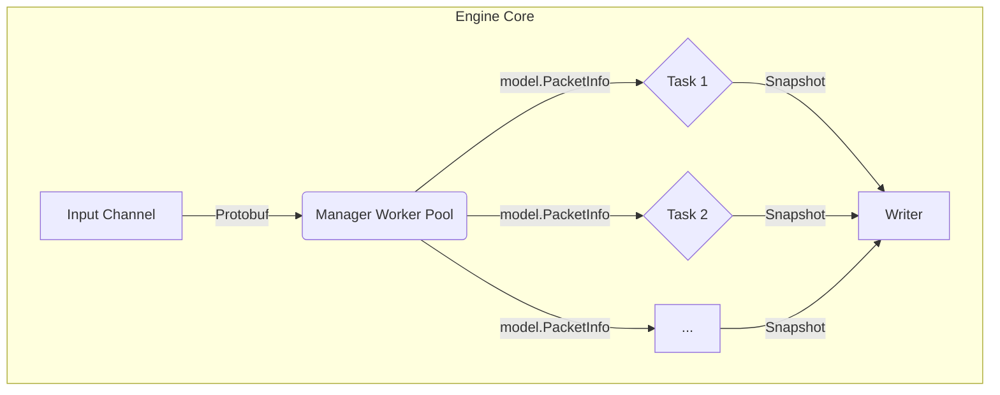
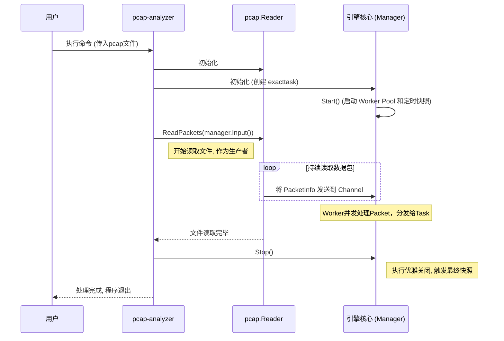
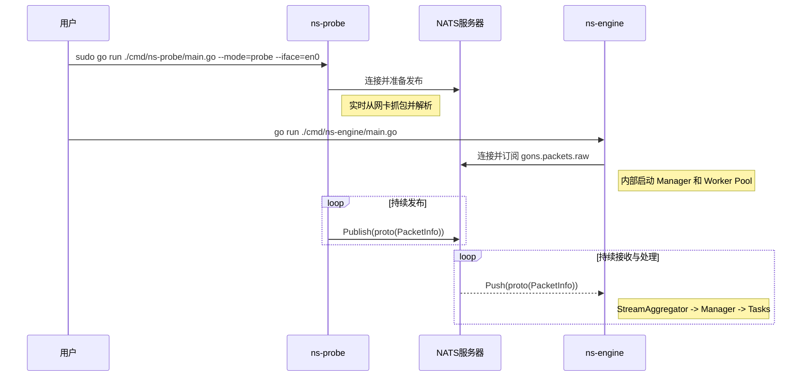

# Go2NetSpectra: 技术选型与架构设计解析

## 1. 核心技术选型

为了构建一个高性能、高扩展性的网络分析框架，我们在技术选型上经过了慎重考量，旨在为项目的长期发展奠定坚实基础。

| 技术领域 | 选择方案 | 理由 |
| :--- | :--- | :--- |
| **核心开发语言** | **Go (Golang)** | **天生的并发优势与卓越性能**。Go语言的 Goroutine 和 Channel 提供了极其轻量且高效的并发编程模型，完美契合网络流量处理中高并发、高吞吐的场景。其编译型语言的特性保证了接近C/C++的运行效率，而强大的标准库和活跃的社区生态则大大加速了开发进程。 |
| **数据包解析** | **gopacket** | **Go生态系统的事实标准**。`gopacket` 是一个功能强大且久经考验的库，它提供了对网络协议栈的精细化解码能力。通过其分层设计，我们可以轻松地访问和解析数据包的任意部分，同时它也具备出色的性能，是构建我们解析引擎的基石。 |
| **配置管理** | **YAML** | **兼具人类可读性与结构化能力**。相比JSON，YAML 格式的配置文件对人类更加友好，更易于阅读和手动编辑。它能清晰地表达复杂的配置结构，使得系统行为的调整无需重新编译代码。 |
| **消息队列** | **NATS** | **轻量、高性能、易于部署**。在实时处理流水线中，我们选择 NATS 作为核心的消息总线。它提供了优秀的解耦能力和水平扩展潜力，同时其简洁的设计和极低的延迟非常适合用作网络遥测数据的传输通道。|
| **数据序列化** | **Protobuf** | **高效、兼容、格式严格**。所有在 NATS 中传输的消息都使用 Protobuf 进行序列化。相比 JSON，Protobuf 提供了更高效的编码效率和更严格的格式校验，是构建高性能数据管道的理想选择。|

---

## 2. 核心引擎架构

`ns-engine` 和 `pcap-analyzer` 共享一套核心处理引擎。该引擎被设计为一个职责清晰、高度解耦的三层模型，这不仅提升了性能，也为未来的功能扩展提供了极大的灵活性。

### 2.1. 顶层设计：接口驱动

架构的基石是 `internal/model` 中定义的一系列核心接口：

- **`model.Task`**: 定义了一个独立的、可插拔的聚合任务。任何实现了此接口的结构体，都可以被视为一个标准的计算单元，由 `Manager` 进行统一调度。
- **`model.Writer`**: 定义了数据写入器的标准行为。这使得聚合任务无需关心数据最终被写入到哪里（本地文件、数据库等），实现了计算与存储的彻底分离。

### 2.2. 核心实现：三层解耦模型

引擎的内部工作流程被清晰地划分为三个层次。



- **数据接入层**: 对于 `ns-engine`，这是 `StreamAggregator`，它从 NATS 接收数据并放入 `Manager` 的输入通道。对于 `pcap-analyzer`，这是 `pcap.Reader`，它从文件读取数据并放入通道。
- **并发调度层 (`Manager`)**: 引擎的“大脑”，负责并发调度和生命周期管理。它内部维护一个 **Worker Pool**，从输入通道消费数据，进行必要的类型转换，然后将数据扇出（Fan-out）给所有已注册的 `Task` 实例。
- **业务执行层 (`Task`)**: 执行具体的聚合计算逻辑。每个 `Task` 都是一个独立的计算单元，例如 `exacttask` 负责精确统计，未来的 `sketchtask` 则可以负责概率统计。

### 2.3. 性能与健壮性亮点

为了在高并发下保证高性能和数据一致性，我们采用了以下设计模式：

- **并发模型：Worker Pool + Channel**: `Manager` 内部启动一个可配置的 **Worker Pool** 并发地处理数据包，充分利用多核CPU资源。数据包通过 `channel` 在生产者和消费者（Worker）之间传递，实现了I/O与计算的并行。
- **无锁并发：分片 (Sharding)**: 在 `exacttask` 内部，为了解决并发访问聚合 `map` 时的锁竞争问题，我们采用了 **分片（Sharding）** 的设计。通过对流的 Key 进行哈希，将不同流的更新压力分散到多个独立的、由独立锁保护的 `map` 中，显著提升了并发性能。
- **原子化快照 (Atomic Snapshotting)**: 在持久化数据时，`exacttask` 采用“原子交换”策略，用一个新的空 `map` 瞬间替换掉旧的 `map`，从而让后台写入任务可以从容地、无锁地处理旧数据，而不阻塞新数据的进入。
- **健壮性：优雅停机 (Graceful Shutdown)**: `Manager` 的 `Stop()` 方法实现了一个多阶段的关闭序列。它会先关闭输入通道，等待所有 `worker` 将缓冲数据处理完毕，最后再触发一次最终快照。这个机制**确保了每一个数据包都在程序退出前被完全统计**，实现了 100% 的数据完整性。

### 2.4. 扩展性亮点：插件式的聚合器工厂

为了实现真正的“可插拔”架构，我们结合了**工厂模式**与 Go 语言的**包初始化**机制。这使得添加一个新的聚合器类型无需修改任何核心引擎代码，只需遵循约定即可，极大地提升了项目的可维护性和扩展性。

`Manager` 的创建过程由配置文件 `config.yaml` 驱动。管理员可以通过 `type` 字段（如 `type: exact`）来声明使用哪种聚合引擎。`manager.NewManager` 函数会通过一个中央工厂，动态地创建出该类型对应的所有 `Task` 实例和 `Writer` 实例。

#### **如何实现一个新的聚合器？**

这个设计的一大亮点是为开发者提供了极简的扩展方式。要向系统中添加一个全新的聚合器（例如，一个基于 `HyperLogLog` 的估算器），开发者只需完成两个步骤：

1.  **实现并注册工厂**：在你的实现包（例如 `internal/engine/impl/hll`）中，实现 `model.Task` 接口，并在包的 `init()` 函数中调用 `factory.RegisterAggregator()`，将聚合器的名字和它的构造工厂函数注册进去。

    ```go
    // internal/engine/impl/hll/task.go
    package hll

    import "Go2NetSpectra/internal/factory"

    func init() {
        factory.RegisterAggregator("hll", newHllFactoryFunc)
    }
    ```

2.  **激活包的初始化**：为了让 Go 编译器在程序启动时执行上述的 `init()` 函数，只需在 `manager` 包中匿名导入（blank import）你的实现包即可。

    ```go
    // internal/engine/manager/manager.go
    import (
        _ "Go2NetSpectra/internal/engine/impl/exact"
        _ "Go2NetSpectra/internal/engine/impl/hll" // <-- 新增匿名导入
    )
    ```

通过这个机制，`Manager` 与具体的 `Task` 实现完全解耦，任何开发者都可以独立开发自己的聚合器插件并轻松集成到 Go2NetSpectra 框架中。

---

## 3. 应用场景与数据流

### 3.1. 离线分析：`pcap-analyzer`

此模式用于对 `.pcap` 文件进行深度分析，其数据流相对简单，所有处理都在单个进程内完成。



### 3.2. 实时监控：`ns-probe` 与 `ns-engine`

这是项目的核心实时流水线，由 `ns-probe` 采集数据，`ns-engine` 处理数据，并通过 NATS 进行解耦。



---

## 4. 总结

Go2NetSpectra 通过接口驱动、分层解耦和配置驱动的设计，构建了一套同时支持离线与实时分析的、健壮且高度可扩展的流量分析引擎。以 `Manager` + `Task` 为核心的并发模型，结合分片、原子快照等优化手段，确保了系统的高性能和数据一致性，为项目未来的功能演进提供了无限可能。