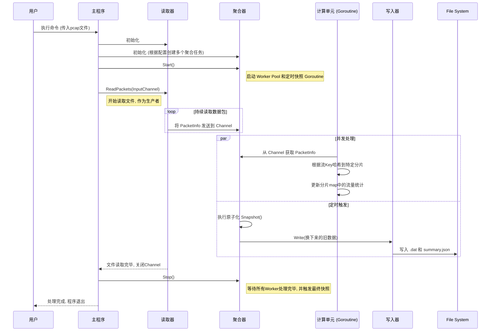

# Go2NetSpectra: 技术选型与架构设计解析

## 1. 核心技术选型

为了构建一个高性能、高扩展性的网络分析框架，我们在技术选型上经过了慎重考量，旨在为项目的长期发展奠定坚实基础。

| 技术领域 | 选择方案 | 理由 |
| :--- | :--- | :--- |
| **核心开发语言** | **Go (Golang)** | **天生的并发优势与卓越性能**。Go语言的 Goroutine 和 Channel 提供了极其轻量且高效的并发编程模型，完美契合网络流量处理中高并发、高吞吐的场景。其编译型语言的特性保证了接近C/C++的运行效率，而强大的标准库（如 `net`, `time`）和活跃的社区生态则大大加速了开发进程。 |
| **数据包解析** | **gopacket** | **Go生态系统的事实标准**。`gopacket` 是一个功能强大且久经考验的库，它提供了对网络协议栈（从L2到L7）的精细化解码能力。通过其分层（Layers）设计，我们可以轻松地访问和解析数据包的任意部分，同时它也具备出色的性能，是构建我们解析引擎的基石。 |
| **配置管理** | **YAML** | **兼具人类可读性与结构化能力**。相比JSON，YAML 格式的配置文件对人类更加友好，更易于阅读和手动编辑。它能清晰地表达复杂的配置结构（如我们的多聚合任务定义），使得系统行为的调整无需重新编译代码。 |
| **API与服务间通信** | **Protocol Buffers** | **面向未来的高效、标准化接口定义**。虽然在第一阶段尚未完全启用，但我们在 `api/proto` 目录下预置了 Protobuf 定义。它能生成类型安全、向后兼容且序列化/反序列化极快的代码，是未来构建分布式系统中服务间（如 `ns-probe` -> `ns-engine`）通信的理想选择。 |

---

## 2. `pcap-analyzer` 架构与高性能设计

第一阶段的核心交付物 `pcap-analyzer` 不仅仅是一个简单的脚本，它的内部架构采用了多种设计模式以实现高效的数据处理。

### 2.1. 核心处理流水线 (Pipeline)

`pcap-analyzer` 的数据处理遵循一个清晰的流水线模型：

**`Reader` -> `Parser` -> `Aggregator` -> `Writer`**

1.  **Reader (`pkg/pcap`)**: 负责从 `.pcap` 文件中读取原始数据包。
2.  **Parser (`internal/engine/protocol`)**: 将原始数据包字节流解码，提取出五元组等关键信息，构造成 `PacketInfo` 结构体。
3.  **Aggregator (`internal/engine/flowaggregator`)**: 流水线的核心，消费 `PacketInfo`，根据预设规则进行流的创建、更新和统计。
4.  **Writer (`internal/snapshot`)**: 将内存中聚合好的数据周期性地、安全地持久化到磁盘。

这种松耦合的设计让每个阶段都可以独立优化，并通过 `channel` 作为“传送带”连接起来。

### 2.2. 高性能设计模式详解

#### **并发模型：Worker Pool + Channel**

- **挑战**: 如果单线程处理，读取文件（I/O操作）和聚合计算（CPU操作）会相互阻塞，无法充分利用现代多核CPU。
- **解决方案**: 我们采用“生产者-消费者”模型。`pcap.Reader` 作为生产者，将解析后的 `PacketInfo` 放入一个带缓冲的 `channel` 中。`FlowAggregator` 则启动一个 **Worker Pool**（由多个goroutine组成）作为消费者，并发地从 `channel` 中取出 `PacketInfo` 进行处理。这使得I/O和计算可以并行进行，极大地提升了整体吞吐量。

#### **无锁并发：分片 (Sharding) 设计**

- **挑战**: 当多个 Worker Goroutine 同时更新一个全局的流量聚合 `map` 时，需要使用互斥锁（Mutex）来保证数据一致性，但这会造成严重的锁竞争，使并发失去意义，性能急剧下降。
- **解决方案**: 我们在 `KeyedAggregator` 中实现了 **分片（Sharding）** 设计。我们不使用一个巨大的全局`map`，而是创建了数百个小的 `map`（称为分片/shard），每个分片都由自己独立的锁来保护。当一个数据包需要更新流信息时，我们根据流的Key（如源IP）计算一个哈希值，通过哈希值定位到具体的分片。这样，不同流的更新操作大概率会落在不同的分片上，从而可以在几乎没有锁竞争的情况下进行并发更新。

#### **原子化快照 (Atomic Snapshotting)**

- **挑战**: 如何在不暂停数据处理（即不长时间加锁）的情况下，安全地将内存中正在实时更新的聚合数据写入磁盘？
- **解决方案**: `KeyedAggregator` 的 `Snapshot()` 方法采用了一种巧妙的“原子交换”策略。当需要进行快照时，它会遍历所有分片，锁定每个分片后，**立即用一个新的空`map`替换掉旧的`map`**，然后解锁。这个过程极快。之后，新的数据包会写入新的空`map`中，而后台的写入任务则可以从容地、无锁地处理它刚刚换下来的那个包含完整数据的旧`map`。

### 2.3. 处理流程时序图

下图展示了 `pcap-analyzer` 从启动到完成处理的完整时序。

---

## 3. 总结

Go2NetSpectra 的第一阶段不仅仅是功能的实现，更是一次高性能工程实践。通过 **Go并发范式**、**分片并发控制** 和 **原子化数据操作** 等技术的综合运用，我们构建了一个健壮且高效的数据处理核心，为未来处理更大数据规模的实时流量打下了坚实的基础。