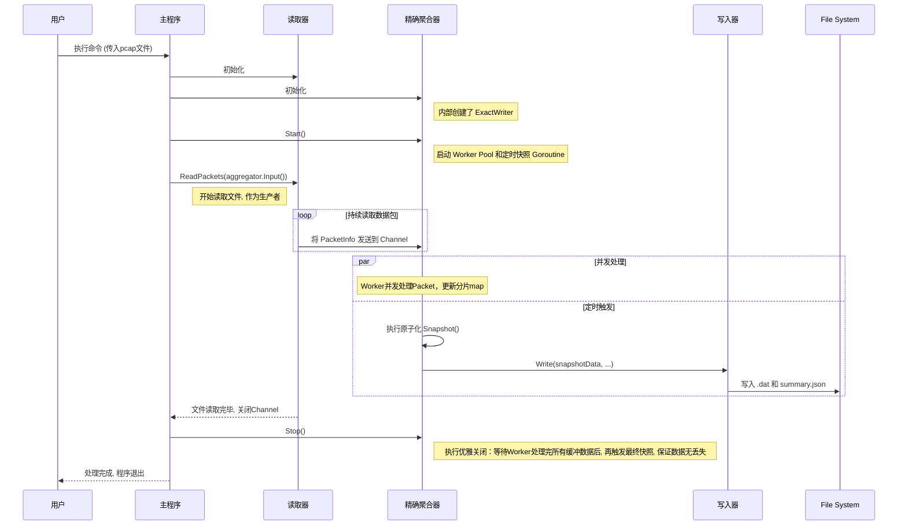

# Go2NetSpectra: 技术选型与架构设计解析

## 1. 核心技术选型

为了构建一个高性能、高扩展性的网络分析框架，我们在技术选型上经过了慎重考量，旨在为项目的长期发展奠定坚实基础。

| 技术领域 | 选择方案 | 理由 |
| :--- | :--- | :--- |
| **核心开发语言** | **Go (Golang)** | **天生的并发优势与卓越性能**。Go语言的 Goroutine 和 Channel 提供了极其轻量且高效的并发编程模型，完美契合网络流量处理中高并发、高吞吐的场景。其编译型语言的特性保证了接近C/C++的运行效率，而强大的标准库和活跃的社区生态则大大加速了开发进程。 |
| **数据包解析** | **gopacket** | **Go生态系统的事实标准**。`gopacket` 是一个功能强大且久经考验的库，它提供了对网络协议栈的精细化解码能力。通过其分层设计，我们可以轻松地访问和解析数据包的任意部分，同时它也具备出色的性能，是构建我们解析引擎的基石。 |
| **配置管理** | **YAML** | **兼具人类可读性与结构化能力**。相比JSON，YAML 格式的配置文件对人类更加友好，更易于阅读和手动编辑。它能清晰地表达复杂的配置结构，使得系统行为的调整无需重新编译代码。 |

---

## 2. 核心架构：接口驱动与可插拔设计

在第一阶段的开发和重构中，我们确立了以接口为核心的驱动设计，这使得系统各个模块之间实现了高度解耦，极大地增强了灵活性和扩展性。

### 2.1. 核心抽象：`Aggregator` 与 `Writer` 接口

我们在 `internal/model` 包中定义了两个核心接口：

- **`model.Aggregator`**: 定义了一个聚合器的标准行为，包括 `Start()`, `Stop()` 和 `Input()`。任何实现了此接口的结构体，都可以被主程序 `pcap-analyzer` 视为一个标准的聚合引擎进行统一管理。
- **`model.Writer`**: 定义了数据写入器的标准行为，包含一个 `Write()` 方法。这使得聚合器无需关心数据最终被写入到哪里（本地文件、数据库、消息队列等），实现了计算与存储的彻底分离。

这种设计允许我们未来可以轻松地开发并接入新的聚合器（如基于概率的 `SketchAggregator`）和新的写入器，而无需改动主干逻辑。

### 2.2. `ExactAggregator`：高性能精确统计实现

作为 `Aggregator` 接口的第一个具体实现，`ExactAggregator` 负责对流量进行精确的计数统计。为了在高并发下保证高性能，它采用了以下设计模式：

- **并发模型：Worker Pool + Channel**: `ExactAggregator` 内部启动一个 **Worker Pool**（由多个goroutine组成）并发地处理数据包，充分利用多核CPU资源。数据包通过 `channel` 在生产者（读取器）和消费者（Worker）之间传递，实现了I/O与计算的并行。

- **无锁并发：分片 (Sharding) 设计**: 为了解决并发访问聚合 `map` 时的锁竞争问题，我们采用了 **分片（Sharding）** 的设计。通过对流的 Key 进行哈希，将不同流的更新压力分散到多个独立的、由独立锁保护的 `map` 中，显著提升了并发性能。

- **原子化快照 (Atomic Snapshotting)**: 在持久化数据时，`KeyedAggregator` 采用“原子交换”策略，用一个新的空`map`瞬间替换掉旧的`map`，从而让后台写入任务可以从容地、无锁地处理旧数据，而不阻塞新数据的进入。

### 2.3. 处理流程时序图

下图展示了 `pcap-analyzer` 在当前架构下的处理流程时序。

### 2.4. 系统健壮性：优雅停机与数据完整性

在高吞吐量的数据处理流水线中，一个核心挑战是确保在程序关闭时的数据完整性。通道中缓存的数据包必须被完全处理，以防止数据丢失。Go2NetSpectra 通过在 `ExactAggregator` 中精心设计的关闭序列来保证这一点。

**挑战**: 当 pcap 文件读取完毕，主进程通知聚合器停止时，可能有成千上万的数据包仍在处理通道中，或正在被 Worker 池处理。一个简单的关闭逻辑可能会导致在这些数据包被完全统计前就生成了最终快照，从而造成统计数据不准确。

**解决方案**: `Stop()` 方法实现了一个多阶段、同步的关闭流程，彻底避免了这种竞争条件：

1.  **关闭输入通道**: 首先关闭 `inputChannel`。这会向 Worker 池发出信号：不会再有新的数据包进入。
2.  **排空并等待 Worker**: 程序会阻塞并等待所有 Worker (`workerWg.Wait()`) 将通道中剩余的所有数据包处理完毕，并完全退出。
3.  **最终快照**: 只有在所有聚合工作完成之后，系统才会向 `snapshotter` 发出信号，执行最后一次完整的快照。
4.  **等待快照完成**: 主进程会等待 `snapshotter` 将最终数据完全写入磁盘后，才最终退出。

这个序列**确保了每一个被读取的数据包都在程序退出前被完全统计**，实现了 100% 的数据完整性，为网络分析提供了可靠的根基。

---

## 3. 总结

Go2NetSpectra 的第一阶段不仅实现了功能，更重要的是通过两次关键重构，确立了一个**接口驱动、高内聚、低耦合**的健壮技术底座。这为项目未来的功能扩展和性能演进提供了无限可能。
