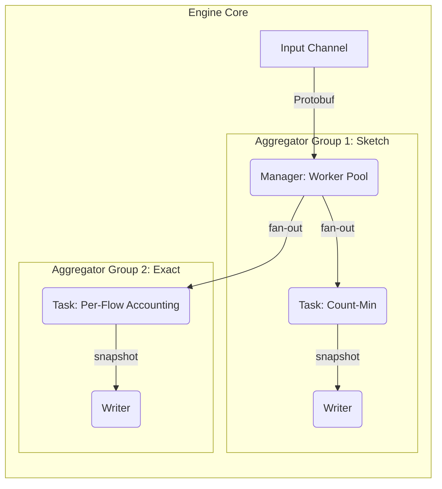

# Go2NetSpectra: 技术选型与架构设计解析

## 1. 核心技术选型

为了构建一个高性能、高扩展性的网络分析框架，我们在技术选型上经过了慎重考量，旨在为项目的长期发展奠定坚实基础。

| 技术领域 | 选择方案 | 理由 |
| :--- | :--- | :--- |
| **核心开发语言** | **Go (Golang)** | **天生的并发优势与卓越性能**。Go语言的 Goroutine 和 Channel 提供了极其轻量且高效的并发编程模型，完美契合网络流量处理中高并发、高吞吐的场景。其编译型语言的特性保证了接近C/C++的运行效率，而强大的标准库和活跃的社区生态则大大加速了开发进程。 |
| **数据包解析** | **gopacket** | **Go生态系统的事实标准**。`gopacket` 是一个功能强大且久经考验的库，它提供了对网络协议栈的精细化解码能力。通过其分层设计，我们可以轻松地访问和解析数据包的任意部分，同时它也具备出色的性能，是构建我们解析引擎的基石。 |
| **配置管理** | **YAML** | **兼具人类可读性与结构化能力**。相比JSON，YAML 格式的配置文件对人类更加友好，更易于阅读和手动编辑。它能清晰地表达复杂的配置结构，使得系统行为的调整无需重新编译代码。 |
| **消息队列** | **NATS** | **轻量、高性能、易于部署**。在实时处理流水线中，我们选择 NATS 作为核心的消息总线。它提供了优秀的解耦能力和水平扩展潜力，同时其简洁的设计和极低的延迟非常适合用作网络遥测数据的传输通道。|
| **数据序列化** | **Protobuf** | **高效、兼容、格式严格**。所有在 NATS 中传输的消息都使用 Protobuf 进行序列化。相比 JSON，Protobuf 提供了更高效的编码效率和更严格的格式校验，是构建高性能数据管道的理想选择。|
| **查询接口** | **gRPC** | **高性能、跨语言的远程调用**。我们选择 gRPC 作为核心的 API 技术。它基于 HTTP/2，使用 Protobuf 进行序列化，性能远超传统的 REST+JSON。其严格的接口定义（IDL）使得 API 的演进和跨语言客户端的生成变得简单可靠。|

---

## 2. 核心引擎架构：并发、隔离与扩展

`ns-engine` 的核心是一个经过精心设计的、支持并发聚合的、可插拔的分析引擎。它不仅实现了高性能，更通过一系列精巧的机制保证了数据处理的隔离性、一致性和可扩展性。

### 2.1. 顶层设计：接口驱动与逻辑分组

架构的基石是 `internal/model` 中定义的核心接口 (`Task`, `Writer`) 和 `internal/factory` 中定义的逻辑分组单元：

- **`model.Task`**: 定义了一个独立的、可插拔的聚合任务。它封装了数据处理（`ProcessPacket`）、数据提取（`Snapshot`）和状态重置（`Reset`）的全部逻辑。
- **`model.Writer`**: 定义了数据写入器的标准行为，负责将 `Task` 的快照持久化。
- **`factory.TaskGroup`**: 这是一个关键的结构，它将一组逻辑相关的 `Task` 和为它们服务的 `Writer` 绑定在一起。

### 2.2. 核心实现：并发调度与隔离执行

引擎的工作流程被清晰地划分为多个层次，确保了职责的单一和高度的解耦。



- **数据接入层**: `StreamAggregator` 从 NATS 消费数据，并将其送入 `Manager` 的输入通道。
- **并发调度层 (`Manager`)**: 引擎的“大脑”。它内部维护一个 **Worker Pool**，从输入通道消费数据包，然后将数据包**扇出（Fan-out）给所有聚合器组中的所有 `Task` 实例**。
- **隔离执行层 (`TaskGroup`)**: `Manager` 不再直接管理 `Task` 和 `Writer` 的扁平列表，而是管理一个 `[]TaskGroup`。当启动时，`Manager` 会遍历每个 `TaskGroup`，并为该组内的每个 `Writer` 启动一个专属的 `snapshotter` 协程。**至关重要的是，这个协程只会被传入其所在 `TaskGroup` 内部的 `Task` 列表**。这确保了 `exact` 的 `Writer` 只会处理 `exact` 的 `Task`，`sketch` 的 `Writer` 只会处理 `sketch` 的 `Task`，彻底解决了数据串扰的问题。

### 2.3. 扩展性亮点：插件式的聚合器工厂

为了实现真正的“可插拔”架构，我们结合了**工厂模式**与 Go 语言的**包初始化**机制。这使得添加一个新的聚合器类型无需修改任何核心引擎代码。

`Manager` 的创建过程由配置文件 `config.yaml` 中的 `aggregator.types` 列表驱动。`manager.NewManager` 函数会通过一个中央工厂，为列表中的每个类型动态地创建出对应的 `TaskGroup`。

#### **如何实现一个新的聚合器？**

1.  **实现并注册工厂**：在你的实现包（例如 `internal/engine/impl/hll`）中，实现 `model.Task` 接口，并在包的 `init()` 函数中调用 `factory.RegisterAggregator()`。这个工厂函数现在必须返回一个 `*factory.TaskGroup`，其中包含了为这个聚合器创建的所有 `Task` 和 `Writer`。

    ```go
    // internal/engine/impl/hll/task.go
    package hll

    import (
        "Go2NetSpectra/internal/factory"
        // ...
    )

    func init() {
        factory.RegisterAggregator("hll", func(cfg *config.Config) (*factory.TaskGroup, error) {
            // ... 创建 tasks 和 writers
            return &factory.TaskGroup{Tasks: tasks, Writers: writers}, nil
        })
    }
    ```

2.  **激活包的初始化**：为了让 Go 编译器在程序启动时执行上述的 `init()` 函数，只需在 `manager` 包中匿名导入（blank import）你的实现包即可。

    ```go
    // internal/engine/manager/manager.go
    import (
        _ "Go2NetSpectra/internal/engine/impl/exact"
        _ "Go2NetSpectra/internal/engine/impl/sketch"
        _ "Go2NetSpectra/internal/engine/impl/hll" // <-- 新增匿名导入
    )
    ```

通过这个机制，`Manager` 与具体的 `Task` 实现完全解耦，任何开发者都可以独立开发自己的聚合器插件并轻松集成到 Go2NetSpectra 框架中。

---

## 3. API 服务架构：智能查询路由

随着引擎支持并发聚合，`ns-api` 服务也演进为一个能够处理多个异构数据源的智能查询网关。

- **多查询器实例 (Multi-Querier)**: `ns-api` 在启动时，不再创建一个单一的 `Querier`。相反，它会检查配置文件中的 `aggregator.types` 列表。如果 `exact` 被启用并且配置了 ClickHouse `Writer`，它就会创建一个 `exactQuerier`。同理，如果 `sketch` 被启用，它会创建 `sketchQuerier`。

- **基于 RPC 的路由**: `QueryServiceServer` 的 gRPC 方法实现现在包含了路由逻辑。当一个请求到达时：
  - `AggregateFlows` 或 `TraceFlow` 请求会被固定地路由到 `exactQuerier`，该查询器连接到 `flow_metrics` 表。
  - `QueryHeavyHitters` 请求会被固定地路由到 `sketchQuerier`，该查询器连接到 `heavy_hitters` 表。

这种设计将后端的复杂性对客户端完全屏蔽，客户端只需调用相应的 gRPC 方法，`ns-api` 内部会自动处理与正确数据源的交互。

---

## 4. 核心技术挑战与解决方案

在 Go2NetSpectra 的架构演进过程中，我们遇到并解决了一系列关键的技术挑战，这些解决方案共同构成了框架健壮性和灵活性的基石。

### 挑战一：聚合器隔离与数据串扰

- **问题描述**: 在引入并发聚合器后，`Manager` 将所有 `Task` 和 `Writer` 放在一个扁平的列表中，导致 `exact` 的 `Writer` 错误地尝试处理 `sketch` 的数据，破坏了数据隔离性。
- **解决方案：引入 `TaskGroup`**
    通过创建 `TaskGroup` 结构，我们在 `Manager` 层面建立了 `Task` 和 `Writer` 之间的逻辑从属关系。`Manager` 的调度循环被重构为围绕 `TaskGroup` 进行，确保了每个 `Writer` 只从其被分配的 `Task` 集合中拉取数据，从而从根本上解决了数据串扰问题。

### 挑战二：异构数据源的统一查询

- **问题描述**: `ns-api` 服务需要同时服务于对 `exact` 精确数据的查询和对 `sketch` 估算数据的查询，而这两类数据可能存储在不同的数据库甚至不同的表中。
- **解决方案：多查询器与请求路由**
    我们在 `ns-api` 中实现了“多查询器”模式。服务在启动时会为每个需要查询的后端（如 `exact` 的 ClickHouse 和 `sketch` 的 ClickHouse）创建独立的 `Querier` 实例。在 gRPC 服务实现中，我们根据被调用的方法（如 `AggregateFlows` vs `QueryHeavyHitters`）将请求分发给对应的 `Querier`，实现了清晰的查询路由。

### 挑战三：多写入器引发的数据竞争

- **问题描述**: 当系统引入多个 `Writer`（如 `gob` 和 `clickhouse`），且它们拥有各自独立的 `snapshot_interval` 时，最初的设计暴露了严重的数据竞争问题。`Snapshot()` 方法在返回数据的同时会重置内部状态。这导致第一个触发快照的 `Writer` 会“偷走”并清空整个测量周期的数据，使得后续的 `Writer` 只能获取到不完整的数据，破坏了数据的一致性。

- **解决方案：只读快照与周期性重置分离**
    1.  **接口职责分离**: 我们重新定义了 `model.Task` 接口，将 `Snapshot()` 的职责严格限定为**只读**操作。它现在只返回当前聚合数据的**深拷贝副本**，确保了在任何时间点获取快照都是安全的，且不会影响其他并发操作。
    2.  **引入 `Reset()` 方法**: 我们为 `Task` 接口增加了一个新的 `Reset()` 方法，其唯一职责就是原子性地清空任务的内部状态。
    3.  **全局重置周期**: 在配置文件中引入了全局的 `aggregator.period`。`Manager` 会启动一个独立的 `resetter` 协程，严格按照这个周期调用所有 `Task` 的 `Reset()` 方法。这确保了所有 `Task` 在同一时间点开启新的测量周期，保证了数据的同步和完整性。

### 挑战四：ClickHouse 查询的复杂性与正确性

- **问题描述**: 由于 `ns-engine` 会在每个 `snapshot_interval` 周期性地写入全量快照，导致 `flow_metrics` 表中存在大量重复的、历史性的流记录。直接使用 `SUM()` 等聚合函数会导致结果被严重夸大。如何从这些包含历史状态的数据中，查询出准确的、去重后的聚合结果？

- **解决方案：使用 `argMax` 函数进行去重**
    1.  **`argMax` 的应用**: 我们利用了 ClickHouse 强大的 `argMax(arg, val)` 函数。这个函数能返回 `val` 值最大时对应的 `arg` 的值。我们用它来“去重”：`argMax(ByteCount, Timestamp)` 会返回具有最新 `Timestamp` 的那条记录的 `ByteCount` 值。
    2.  **子查询与两阶段聚合**: 我们的最终查询采用了一个两阶段的聚合模式：
        *   **内层子查询**: 首先，按流的唯一标识（`TaskName` 加上所有可能的键字段）进行 `GROUP BY`。在每个流的分组内，使用 `argMax` 找出该流最新的 `ByteCount` 和 `PacketCount`。
        *   **外层查询**: 然后，对外层查询的结果（即所有流的最新状态集合）进行最终的 `SUM()` 聚合，从而得到准确的总量统计。

### 挑战五：Sketch 无锁高并发实现与性能优化

- **问题描述**

`sketch` 聚合任务需要在高并发场景下处理海量数据包。如何设计一个**无锁的高效插入算法**，在保证估算准确性的同时进一步优化性能，是本节的关键难点。

测试环境如下：

* **操作系统**: Windows
* **架构**: amd64
* **CPU**: Intel(R) Core(TM) i7-14700
* **内存**: 32GB
* **数据集**: 1 分钟 CAIDA 数据（约 3000w 数据包）

Exact 实现

| Benchmark                  | 次数 | ns/op          | B/op           | allocs/op   |
| -------------------------- | -- | -------------- | -------------- | ----------- |
| Insert\_Exact\_Parallel    | 20 | 10,983,738,105 | 11,014,365,030 | 119,691,492 |
| Query\_Exact\_Parallel     | 20 | 1,932,864,770  | 478,765,974    | 29,922,873  |
| Insert\_Exact\_Parallel-28 | 20 | 2,072,073,550  | 11,014,366,925 | 119,691,507 |
| Query\_Exact\_Parallel-28  | 20 | 358,693,415    | 478,766,535    | 29,922,877  |

初始 Sketch 实现

| Benchmark                   | 次数 | ns/op         | B/op          | allocs/op  |
| --------------------------- | -- | ------------- | ------------- | ---------- |
| Insert\_Sketch\_Parallel    | 20 | 6,947,662,510 | 1,436,298,008 | 59,845,747 |
| Query\_Sketch\_Parallel     | 20 | 117,591,335   | 6             | 0          |
| Insert\_Sketch\_Parallel-28 | 20 | 2,502,471,279 | 1,436,303,843 | 59,845,781 |
| Query\_Sketch\_Parallel-28  | 20 | 588,142,050   | 114           | 3          |

* 插入性能：Sketch **快 2–3 倍**
* 查询性能：Sketch **快 1.5–2 倍**
* 内存占用：Sketch **小 7–8 倍**
* 对象分配：Sketch **少 2 倍**

> Exact 基于 `map`，必须存储所有流，内存与对象分配随流量线性增长。
>
> Sketch 内存大小取决于 CountMin 配置，固定不随流量增长。例如：
> 
>* 配置：2^13 × 2 × (16 + 16 + 4 + 4) = **655,360B ≈ 0.625MB**
> * 在此内存下，大流检测误差率 < **0.1%**，F1 > **0.98**

#### **性能瓶颈分析**


通过 `pprof` 火焰图分析，发现主要瓶颈如下：

1. **GC 开销过大**

   * 插入过程中频繁创建临时对象，导致频繁触发垃圾回收。

2. **锁竞争严重**

   * `Insert` 方法对 CountMin 每个桶加锁，虽然是细粒度锁，但在高并发下仍存在严重竞争。

3. **标签计算开销**

   * `makeslice` 与 `makeslicecopy` 开销显著。
   * 原因：插入时频繁创建新的 `[]byte` 标签对象，导致 GC 压力增大。

#### **优化方案**

1. **无锁插入**

   * 使用 **`atomic.CompareAndSwapUint32 (CAS)`** 实现计数器更新。
   * 避免 goroutine 挂起和上下文切换，在高争用下优于互斥锁。
   * Flow key 替换无法完全无锁，但其在桶稳定后频率大幅下降，对整体性能影响有限。

2. **对象缓存池**

   * 引入 **`sync.Pool`** 缓存流标签和元素标签的 `[]byte`。
   * `Insert` 时复用切片，用后归还池中。
   * 显著减少内存分配和 GC 开销。

3. **优化效果**
   * 火焰图显示耗时函数明显减少，开销集中于核心计算逻辑。
   * 插入总耗时由 **340.46s → 260.98s**
   * GC 开销由 **140.82s → 106.85s**


| Benchmark                   | 次数 | ns/op           | B/op          | allocs/op  |
| --------------------------- | -- | --------------- | ------------- | ---------- |
| Insert\_Sketch\_Parallel-28 | 20 | **582,881,990** | 1,436,303,843 | 59,845,781 |
| Query\_Sketch\_Parallel-28  | 20 | **156,699,235** | 89            | 1          |


* 插入耗时：**2,502,471,279 ns → 582,881,990 ns** （**提速 4.3 倍**）
* 查询耗时：**588,142,050 ns → 156,699,235 ns** （**提速 3.7 倍**）

当然可以，我帮你把文字润色得更清晰，同时把 benchmark 数据整理成 Markdown 表格：

---

#### 基数测量、超级传播者检测与 DDoS 攻击检测

基数测量需要去重操作，传统方法通常依赖嵌套的 Map 结构实现，但这会导致内存开销巨大且不可控。超级传播者检测旨在统计每个源 IP 所连接的不同目的 IP 数量，常用于识别 DDoS 攻击源或蠕虫传播节点。

假设有 **60 万个源 IP**，每个源 IP 连接 **1000 个不同目的 IP**，则精确存储所需的内存约为：

```
60w * 1000 * 16B = 9.6 GB
```

而采用概率算法 **SuperSpread**，配置为 `m = 2^20`, `size = 128`, `b = 4`, `base = 2`，内存开销仅为：

```
2^20 * ((128*4/8)B + 4B + 16B) ≈ 84 MB
```

因此，在我们的框架中，并没有集成精确的基数测量算法，而是通过 **SuperSpread** 这种概率算法来实现高效的超级传播者检测。

性能对比结果如下：

| 方法                | 操作     | 并发       | ns/op          | B/op          | allocs/op   |
| ----------------- | ------ | -------- | -------------- | ------------- | ----------- |
| SS (SuperSpread)  | Insert | Parallel | 1,883,765,096  | 1,734,932,524 | 72,288,723  |
| SS (SuperSpread)  | Query  | Parallel | 285,806,310    | 113           | 2           |
| Exact (SpreadMap) | Insert | Parallel | 12,925,593,215 | 2,323,364,335 | 144,577,553 |
| Exact (SpreadMap) | Query  | Parallel | 710,958,094    | 581,672,208   | 36,144,351  |

插入性能：**SuperSpread 快 6.8 倍**
查询性能：**SuperSpread 快 2.5 倍**

### 挑战六：异构 Sketch 算法的统一框架

- **问题描述**: 在 `sketch` 聚合器下，我们希望同时支持用于**频率估算**的 `Count-Min` 和用于**基数估算**的 `SuperSpread`。这两种算法的目标、配置参数和内部逻辑完全不同。如何设计一个统一的 `sketch` 任务，使其能够根据配置动态加载并运行其中任意一种算法，而无需为每种算法都创建一个新的聚合器类型？

- **解决方案：配置驱动的动态实例化**
    1.  **统一接口**: 我们确保 `CountMin` 和 `SuperSpread` 都实现了统一的 `statistic.Sketch` 接口 (`Insert`, `Query`, `HeavyHitters`, `Reset`)，使得上层 `Task` 可以无差别地调用它们。
    2.  **扩展配置结构**: 在 `config.yaml` 的 `sketch` 任务定义中，我们增加了一个 `skt_type` 字段（`0` 代表 `CountMin`，`1` 代表 `SuperSpread`），并为 `SuperSpread` 添加了 `m`, `size`, `base`, `b` 等专属配置项。
    3.  **动态构造函数**: `sketch.New` 任务构造函数被重构，它接收整个 `SketchTaskDef` 配置结构。函数内部使用一个 `switch` 语句，根据 `skt_type` 的值来判断应该调用 `statistic.NewCountMin` 还是 `statistic.NewSuperSpread`，并传入各自所需的参数。

    这个方案将“选择哪种算法”的决定权完全交给了用户配置，使得 `Task` 层代码保持了极高的通用性和稳定性。未来若要支持第三种 `sketch` 算法，我们只需实现其算法逻辑，并在 `New` 函数的 `switch` 中增加一个新的 `case` 即可，充分体现了框架的灵活性和可扩展性。

### 挑战七：高流量场景下的内存分配优化

- **问题描述**: 在对 `sketch` 任务进行性能剖析（profiling）时，我们发现 `Insert` 的热路径上存在严重的性能瓶颈。每一次数据包处理都需要为 `flow` 标签和 `element` 标签创建新的 `[]byte` 切片。在每秒处理数十万甚至上百万数据包的场景下，这产生了海量的内存分配，给 Go 的垃圾回收器（GC）带来了巨大压力，导致 GC 频繁暂停（Stop-the-World），显著降低了系统的整体吞吐量。

- **解决方案：引入 `sync.Pool` 缓存临时对象**
    我们利用 Go 标准库中的 `sync.Pool` 来创建一个临时对象的缓存池。`flow` 和 `element` 的 `[]byte` 切片不再在每次调用时重新分配，而是从池中获取（`Get`）。当处理完毕后，这些切片会通过 `defer` 语句被归还（`Put`）到池中，以供下一次处理复用。这个简单的改动极大地减少了 `Insert` 路径上的内存分配次数，显著降低了 GC 压力，从而将 CPU 资源更多地用于核心计算逻辑，最终使 `sketch` 任务的插入性能获得了数量级的提升。

---

## 3. 探针设计：异步持久化

`ns-probe` 的一个关键设计是其可选的异步持久化功能。为了在不影响核心抓包和发布性能的前提下，实现对原始流量的本地备份，我们设计了一个 `persistent.Worker`。

- **核心组件**: `persistent.Worker` 内部维护一个带缓冲的 channel 和一个独立的协程池。
- **工作流程**: `Publisher` 在将数据包发布到 NATS 的同时，只需将数据包（原始 `gopacket.Packet` 或解析后的 `model.PacketInfo`）**非阻塞地**发送到 `persistent.Worker` 的 channel 中。独立的 worker 协程会从 channel 中消费数据，并根据配置（`text`, `gob`, `pcap`）将其写入磁盘。
- **设计优势**: 这种设计将磁盘 I/O 的延迟与网络发布的主路径完全解耦，确保了在高吞吐量的抓包场景下，开启持久化功能不会引入性能瓶颈。

---

## 4. 应用场景与数据流

### 4.1. 离线分析：`pcap-analyzer`

此模式用于对 `.pcap` 文件进行深度分析，其数据流相对简单，所有处理都在单个进程内完成。


### 4.2. 实时监控与查询

这是项目的核心实时流水线，由 `ns-probe` 采集数据，`ns-engine` 处理并写入 ClickHouse，`ns-api` 提供 **gRPC** 查询服务，最终由 Grafana 或其他客户端进行消费。


---

## 5. 环境配置管理

为了解决本地开发和容器化部署之间环境不一致的问题（特别是服务发现地址），我们采用了多配置文件策略：

- **`configs/config.yaml`**: 专用于本地开发。在此文件中，所有服务地址（如 NATS, ClickHouse）都配置为 `localhost`，以便于本地运行的 Go 程序连接到通过 Docker 暴露在主机上的依赖服务。
- **`configs/config.docker.yaml`**: 专用于容器化部署。此文件在构建 Docker 镜像时会被复制到容器的 `/configs/config.yaml` 路径。其中，所有服务地址都使用 Docker Compose 的服务名（如 `nats`, `clickhouse`），以利用 Docker 的内部 DNS 进行服务发现。

这种分离确保了两种开发模式可以无缝切换，而无需在每次切换时手动修改配置。