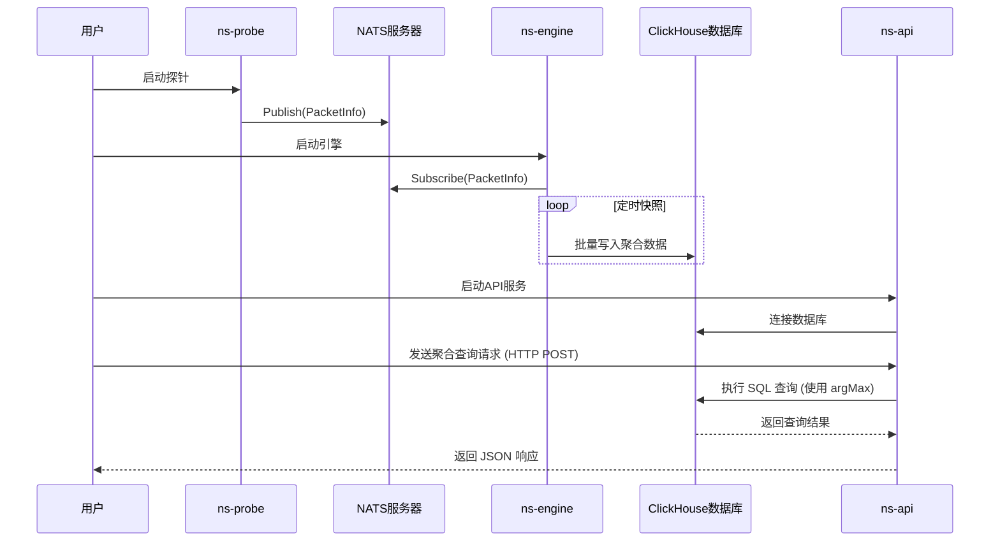

# Go2NetSpectra: 技术选型与架构设计解析

## 1. 核心技术选型

为了构建一个高性能、高扩展性的网络分析框架，我们在技术选型上经过了慎重考量，旨在为项目的长期发展奠定坚实基础。

| 技术领域 | 选择方案 | 理由 |
| :--- | :--- | :--- |
| **核心开发语言** | **Go (Golang)** | **天生的并发优势与卓越性能**。Go语言的 Goroutine 和 Channel 提供了极其轻量且高效的并发编程模型，完美契合网络流量处理中高并发、高吞吐的场景。其编译型语言的特性保证了接近C/C++的运行效率，而强大的标准库和活跃的社区生态则大大加速了开发进程。 |
| **数据包解析** | **gopacket** | **Go生态系统的事实标准**。`gopacket` 是一个功能强大且久经考验的库，它提供了对网络协议栈的精细化解码能力。通过其分层设计，我们可以轻松地访问和解析数据包的任意部分，同时它也具备出色的性能，是构建我们解析引擎的基石。 |
| **配置管理** | **YAML** | **兼具人类可读性与结构化能力**。相比JSON，YAML 格式的配置文件对人类更加友好，更易于阅读和手动编辑。它能清晰地表达复杂的配置结构，使得系统行为的调整无需重新编译代码。 |
| **消息队列** | **NATS** | **轻量、高性能、易于部署**。在实时处理流水线中，我们选择 NATS 作为核心的消息总线。它提供了优秀的解耦能力和水平扩展潜力，同时其简洁的设计和极低的延迟非常适合用作网络遥测数据的传输通道。|
| **数据序列化** | **Protobuf** | **高效、兼容、格式严格**。所有在 NATS 中传输的消息都使用 Protobuf 进行序列化。相比 JSON，Protobuf 提供了更高效的编码效率和更严格的格式校验，是构建高性能数据管道的理想选择。|

---

## 2. 核心引擎架构

`ns-engine` 和 `pcap-analyzer` 共享一套核心处理引擎。该引擎被设计为一个职责清晰、高度解耦的三层模型，这不仅提升了性能，也为未来的功能扩展提供了极大的灵活性。

### 2.1. 顶层设计：接口驱动

架构的基石是 `internal/model` 中定义的一系列核心接口：

- **`model.Task`**: 定义了一个独立的、可插拔的聚合任务。它包含 `ProcessPacket` 用于处理数据包，`Snapshot` 用于提供当前聚合数据的只读快照，以及 `Reset` 用于清空内部状态以开始新的测量周期。任何实现了此接口的结构体，都可以被视为一个标准的计算单元，由 `Manager` 进行统一调度。
- **`model.Writer`**: 定义了数据写入器的标准行为。它包含 `Write` 方法用于将数据持久化，以及 `GetInterval` 方法用于告知 `Manager` 其期望的快照频率。这使得聚合任务无需关心数据最终被写入到哪里（本地文件、数据库等），实现了计算与存储的彻底分离。

### 2.2. 核心实现：三层解耦模型

引擎的内部工作流程被清晰地划分为三个层次。


- **数据接入层**: 对于 `ns-engine`，这是 `StreamAggregator`，它从 NATS 接收数据并放入 `Manager` 的输入通道。对于 `pcap-analyzer`，这是 `pcap.Reader`，它从文件读取数据并放入通道。
- **并发调度层 (`Manager`)**: 引擎的“大脑”，负责并发调度和生命周期管理。它内部维护一个 **Worker Pool**，从输入通道消费数据，进行必要的类型转换，然后将数据扇出（Fan-out）给所有已注册的 `Task` 实例。
- **业务执行层 (`Task`)**: 执行具体的聚合计算逻辑。每个 `Task` 都是一个独立的计算单元，例如 `exacttask` 负责精确统计，未来的 `sketchtask` 则可以负责概率统计。

### 2.3. 性能与健壮性亮点

为了在高并发下保证高性能和数据一致性，我们采用了以下设计模式：

- **异步持久化探针**: `ns-probe` 在将数据包发布到 NATS 之前，可以选择性地将数据包**异步**写入本地文件。我们为此设计了一个 `persistent.Worker`，它内部维护一个带缓冲的 channel 和一个独立的协程池。`Publisher` 只需将数据包（原始 `gopacket.Packet` 或解析后的 `model.PacketInfo`）非阻塞地发送到 channel 中，独立的 worker 协程会负责处理磁盘 I/O。这种设计将磁盘写入的延迟与网络发布的主路径完全解耦，确保了持久化功能不会影响探针的抓包和发布性能。
- **并发模型：Worker Pool + Channel**: `Manager` 内部启动一个可配置的 **Worker Pool** 并发地处理数据包，充分利用多核CPU资源。数据包通过 `channel` 在生产者和消费者（Worker）之间传递，实现了I/O与计算的并行。
- **无锁并发：分片 (Sharding)**: 在 `exacttask` 内部，为了解决并发访问聚合 `map` 时的锁竞争问题，我们采用了 **分片（Sharding）** 的设计。通过对流的 Key 进行哈希，将不同流的更新压力分散到多个独立的、由独立锁保护的 `map` 中，显著提升了并发性能。
- **只读快照 (Read-Only Snapshot)**: `Task` 的 `Snapshot()` 方法现在严格执行**只读操作**。它会返回当前聚合数据的**深拷贝副本**，确保在数据写入过程中，聚合任务的内部状态不会被修改，从而避免了并发写入时的数据不一致问题。
- **周期性重置 (Periodic Reset)**: `Manager` 引入了一个独立的 `resetter` 协程，根据全局配置的 `period` 定期触发所有 `Task` 的 `Reset()` 方法。`Reset()` 方法负责原子性地清空 `Task` 的内部聚合状态，为新的测量周期做准备。这种机制将数据读取（快照）和数据清零（重置）的职责彻底分离，保证了数据在每个测量周期内的完整性和准确性。
- **灵活的写入器调度**: 每个 `Writer` 都可以独立配置其 `snapshot_interval`。`Manager` 会为每个启用的 `Writer` 启动一个独立的 `snapshotter` 协程，按照各自的 `snapshot_interval` 频率从 `Task` 获取只读快照并进行持久化。这使得不同数据目标可以有不同的写入频率，极大地提升了系统的灵活性。
- **健壮性：优雅停机 (Graceful Shutdown)**: `Manager` 的 `Stop()` 方法实现了一个多阶段的关闭序列。它会先关闭输入通道，等待所有 `worker` 将缓冲数据处理完毕，然后信号通知所有 `snapshotter` 和 `resetter` 协程执行最终的快照和重置操作。这个机制**确保了每一个数据包都在程序退出前被完全统计**，实现了 100% 的数据完整性。

### 2.4. 扩展性亮点：插件式的聚合器工厂与灵活的写入器配置

为了实现真正的“可插拔”架构，我们结合了**工厂模式**与 Go 语言的**包初始化**机制。这使得添加一个新的聚合器类型无需修改任何核心引擎代码，只需遵循约定即可，极大地提升了项目的可维护性和扩展性。

`Manager` 的创建过程由配置文件 `config.yaml` 驱动。管理员可以通过 `type` 字段（如 `type: exact`）来声明使用哪种聚合引擎。`manager.NewManager` 函数会通过一个中央工厂，动态地创建出该类型对应的所有 `Task` 实例和**预配置的 `Writer` 实例**。

#### **如何实现一个新的聚合器？**

这个设计的一大亮点是为开发者提供了极简的扩展方式。要向系统中添加一个全新的聚合器（例如，一个基于 `HyperLogLog` 的估算器），开发者只需完成两个步骤：

1.  **实现并注册工厂**：在你的实现包（例如 `internal/engine/impl/hll`）中，实现 `model.Task` 接口，并在包的 `init()` 函数中调用 `factory.RegisterAggregator()`，将聚合器的名字和它的构造工厂函数注册进去。这个工厂函数现在需要返回 `Task` 实例列表和**已根据配置创建好的 `Writer` 实例列表**。

    ```go
    // internal/engine/impl/hll/task.go
    package hll

    import (
        "Go2NetSpectra/internal/config"
        "Go2NetSpectra/internal/factory"
        "Go2NetSpectra/internal/model"
        "time"
    )

    func init() {
        factory.RegisterAggregator("hll", func(cfg *config.Config) ([]model.Task, []model.Writer, error) {
            hllCfg := cfg.Aggregator.HLL // 假设HLL有自己的配置块

            // 创建HLL任务实例
            tasks := make([]model.Task, len(hllCfg.Tasks))
            for i, taskCfg := range hllCfg.Tasks {
                tasks[i] = NewHLLTask(taskCfg.Name, taskCfg.KeyFields) // 假设HLL任务的构造函数
            }

            // 创建并返回配置中启用的Writer实例
            writers := make([]model.Writer, 0, len(hllCfg.Writers))
            for _, writerDef := range hllCfg.Writers {
                if !writerDef.Enabled {
                    continue
                }
                interval, _ := time.ParseDuration(writerDef.SnapshotInterval)
                var writer model.Writer
                switch writerDef.Type {
                case "gob":
                    writer = NewGobWriter(writerDef.Gob.RootPath, interval)
                case "clickhouse":
                    writer, _ = NewClickHouseWriter(writerDef.ClickHouse, interval)
                // ... 其他writer类型
                }
                writers = append(writers, writer)
            }
            return tasks, writers, nil
        })
    }
    ```

2.  **激活包的初始化**：为了让 Go 编译器在程序启动时执行上述的 `init()` 函数，只需在 `manager` 包中匿名导入（blank import）你的实现包即可。

    ```go
    // internal/engine/manager/manager.go
    import (
        _ "Go2NetSpectra/internal/engine/impl/exact"
        _ "Go2NetSpectra/internal/engine/impl/hll" // <-- 新增匿名导入
    )
    ```

通过这个机制，`Manager` 与具体的 `Task` 实现完全解耦，任何开发者都可以独立开发自己的聚合器插件并轻松集成到 Go2NetSpectra 框架中。同时，每个聚合器类型可以根据其配置，灵活地创建和管理其专属的写入器，实现了高度的定制化和可扩展性。

---

## 2.5. 核心技术挑战与解决方案

在 Go2NetSpectra 的架构演进过程中，我们遇到并解决了一些关键的技术挑战，这些解决方案共同构成了框架健壮性和灵活性的基石。

### 挑战一：多写入器引发的数据竞争

- **问题描述**: 当系统引入多个 `Writer`（如 `gob` 和 `clickhouse`），且它们拥有各自独立的 `snapshot_interval` 时，最初的设计暴露了严重的数据竞争问题。`Snapshot()` 方法在返回数据的同时会重置内部状态。这导致第一个触发快照的 `Writer` 会“偷走”并清空整个测量周期的数据，使得后续的 `Writer` 只能获取到不完整的数据，破坏了数据的一致性。

- **解决方案：只读快照与周期性重置分离**
    1.  **接口职责分离**: 我们重新定义了 `model.Task` 接口，将 `Snapshot()` 的职责严格限定为**只读**操作。它现在只返回当前聚合数据的**深拷贝副本**，确保了在任何时间点获取快照都是安全的，且不会影响其他并发操作。
    2.  **引入 `Reset()` 方法**: 我们为 `Task` 接口增加了一个新的 `Reset()` 方法，其唯一职责就是原子性地清空任务的内部状态。
    3.  **全局重置周期**: 在配置文件中引入了全局的 `aggregator.period`。`Manager` 会启动一个独立的 `resetter` 协程，严格按照这个周期调用所有 `Task` 的 `Reset()` 方法。这确保了所有 `Task` 在同一时间点开启新的测量周期，保证了数据的同步和完整性。

### 挑战二：灵活的写入器调度与配置

- **问题描述**: 如何让用户能够灵活地为一组聚合任务配置多个不同的数据写入目标，并且每个目标都可以独立启用、禁用，并拥有自己的写入频率？

- **解决方案：配置驱动的独立调度器**
    1.  **配置结构化**: 我们将 `writers` 的定义从全局配置移至每个聚合器类型（如 `exact`）的配置块下。每个 `writer` 的定义都包含了 `enabled`、`type` 和 `snapshot_interval` 字段。
    2.  **`Manager` 作为编排者**: `Manager` 的角色被重新定义。在启动时，它不再关心 `Writer` 的具体创建过程，而是从 `Factory` 获取已创建好的 `Writer` 实例列表。
    3.  **独立调度**: `Manager` 会遍历这个 `Writer` 列表，为每一个 `Writer` 启动一个专属的 `snapshotter` 协程。每个 `snapshotter` 都使用其对应 `Writer` 的 `GetInterval()` 方法返回的独立周期来驱动自己的定时器，从而实现了完全解耦的、独立的写入调度。

### 挑战三：动态聚合任务的数据库存储

- **问题描述**: `exact` 聚合任务允许用户通过 `key_fields` 配置任意的字段组合（如五元组、源IP、目的端口等）来进行聚合。如何设计一个能够容纳这些动态聚合结果的、统一的数据库表结构，同时保证查询效率？

- **解决方案：“宽表”与动态映射**
    1.  **通用宽表设计**: 我们在 ClickHouse 中设计了一张名为 `flow_metrics` 的“宽表”。这张表包含了**所有可能**用作聚合键的字段（`SrcIP`, `DstIP`, `SrcPort` 等），并将它们全部设置为 `Nullable`（可为空）。
    2.  **结构化数据载体**: 我们在 `statistic.Flow` 结构体中增加了一个 `map[string]interface{}` 类型的 `Fields` 字段。当一个 `Flow` 被创建时，构成其聚合键的实际字段和值会被存入这个 `map` 中。
    3.  **写入时动态映射**: `ClickHouseWriter` 在写入数据时，会遍历 `Flow` 的 `Fields` map，并将其中的值动态地映射到 `flow_metrics` 表对应的列中。对于 `Fields` map 中不存在的字段，数据库将自动填充为 `NULL`。这个方案不仅解决了动态存储的问题，还使得跨不同聚合任务的复杂查询成为可能。

### 挑战四：ClickHouse 查询的复杂性与正确性

- **问题描述**: 由于 `ns-engine` 会在每个 `snapshot_interval` 周期性地写入全量快照，导致 `flow_metrics` 表中存在大量重复的、历史性的流记录。直接使用 `SUM()` 等聚合函数会导致结果被严重夸大。如何从这些包含历史状态的数据中，查询出准确的、去重后的聚合结果？

- **解决方案：使用 `argMax` 函数进行去重**
    1.  **`argMax` 的应用**: 我们利用了 ClickHouse 强大的 `argMax(arg, val)` 函数。这个函数能返回 `val` 值最大时对应的 `arg` 的值。我们用它来“去重”：`argMax(ByteCount, Timestamp)` 会返回具有最新 `Timestamp` 的那条记录的 `ByteCount` 值。
    2.  **子查询与两阶段聚合**: 我们的最终查询采用了一个两阶段的聚合模式：
        *   **内层子查询**: 首先，按流的唯一标识（`TaskName` 加上所有可能的键字段）进行 `GROUP BY`。在每个流的分组内，使用 `argMax` 找出该流最新的 `ByteCount` 和 `PacketCount`。
        *   **外层查询**: 然后，对外层查询的结果（即所有流的最新状态集合）进行最终的 `SUM()` 聚合，从而得到准确的总量统计。
    3.  **语法陷阱**: 在实现过程中，我们还解决了 ClickHouse 的一些语法陷阱，例如 `GROUP BY` 子句中不能包含聚合函数的别名，以及 `SELECT` 子句中非聚合列必须出现在 `GROUP BY` 子句中等问题。

---

## 3. 探针设计：异步持久化

`ns-probe` 的一个关键设计是其可选的异步持久化功能。为了在不影响核心抓包和发布性能的前提下，实现对原始流量的本地备份，我们设计了一个 `persistent.Worker`。

- **核心组件**: `persistent.Worker` 内部维护一个带缓冲的 channel 和一个独立的协程池。
- **工作流程**: `Publisher` 在将数据包发布到 NATS 的同时，只需将数据包（原始 `gopacket.Packet` 或解析后的 `model.PacketInfo`）**非阻塞地**发送到 `persistent.Worker` 的 channel 中。独立的 worker 协程会从 channel 中消费数据，并根据配置（`text`, `gob`, `pcap`）将其写入磁盘。
- **设计优势**: 这种设计将磁盘 I/O 的延迟与网络发布的主路径完全解耦，确保了在高吞吐量的抓包场景下，开启持久化功能不会引入性能瓶颈。

---

## 4. 应用场景与数据流

### 3.1. 离线分析：`pcap-analyzer`

此模式用于对 `.pcap` 文件进行深度分析，其数据流相对简单，所有处理都在单个进程内完成。


### 3.2. 实时监控与查询

这是项目的核心实时流水线，由 `ns-probe` 采集数据，`ns-engine` 处理并写入 ClickHouse，`ns-api` 提供查询服务。



---

## 4. 总结

Go2NetSpectra 通过接口驱动、分层解耦和配置驱动的设计，构建了一套同时支持离线与实时分析的、健壮且高度可扩展的流量分析引擎。以 `Manager` + `Task` 为核心的并发模型，结合分片、只读快照、周期性重置等优化手段，确保了系统的高性能和数据一致性，为项目未来的功能演进提供了无限可能。
